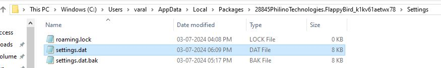

# Analizing Saved Files of FLAPPY BIRD

Open the Flappy Bird Game and make some score. This score will initially be your high score.  
  
Now browse through the folders on your PC to get the saved files of the game.  
The saved files of the game is stored in:  

    C:\Users\<username>\AppData\Local\Packages\28845PhilinoTechnologies.FlappyBird_k1kv61aetwx78\Settings
  
There you can find a settings.dat file which gets modified as you set a new high score everytime.  
Copy this file on your PC and continue playing the game. Set a new high score this time.  
  
Get back to the file settings.dat and see that it gets modified again. Copy the file to the same place as before.  
  
Open the HxD application and import both the files. In the analysis section compare its values.  
As our first high score was 4 and the second high score was 5 then we will look for 0x04 and 0x05 values at the same position.
  
After getting this position, we know that the score is saved at this position only. Change its value as you wish. Let us change the value to 78 which is denoted as 0x4E in hexadecimal form.  
  
Save the file. Open the game again and check the new high score !!
  