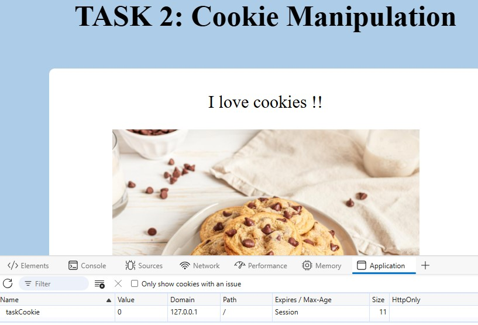

# PROJECT 2
## TASK 1: SQL Injection
Using SQL injection techniques we need to login as admin.
Type username as 'admin' and any random password like 'xyz'. 

  

If the query is in the way:

    SELECT * FROM <TABLE> WHERE USERNAME='admin' AND PASSWORD='___'

So in order to login as admin we can try to comment out the rest of the command. 

**USERNAME: admin'--**

## TASK 2: Cookie Manipulation
As the name suggests it is something related to cookies.
Inspect the page and look for the cookies. We can see that there is a 'taskCookie' with value 0.

   

What about changing the value of cookie to 1 and refreshing the page.

  

Yayy! We completed it.
## TASK 3: Navigate the Secret Path
We need to get a secet path in order to complete the task.

  

Try adding "/secret" in front of the URL. Yeahh it worked.

  

Now we need to get the hidden treasure. Try adding "/hidden" in front of the URL. Task completed.

  

## TASK 4: Find Me
  

First step in any web exploitation challenge is to inspect. Inspect it and there it is, Task completed.

  

## TASK 5: Network
As the name suggest we need to look for the networks tab by inspecting the page.

  

In the networks tab we can see a different value which looks like encoded in base64.

  

Decoding the given value online.

  