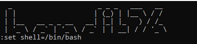

# CHALLENGE 1 : Bandit Writeup
## LEVEL 0
    Command: ssh bandit0@bandit.labs.overthewire.org -p 2220
    Password: bandit0


## LEVEL 0 → LEVEL 1
    Command: ls, cat readme
    Reason: To read the content of the readme file
    Password: NH2SXQwcBdpmTEzi3bvBHMM9H66vVXjL


## LEVEL 1 → LEVEL 2
    Command: ls, cat<-
    Reason: It is given that the password for the next level is in the file in the folder – in the home directory.
    Password: rRGizSaX8Mk1RTb1CNQoXTcYZWU6lgzi


## LEVEL 2 → LEVEL 3
    Command:ls, cat <filename>
    Reason: When the filename has spaces, write the name in quotation marks
    Password: aBZ0W5EmUfAf7kHTQeOwd8bauFJ2lAiG


## LEVEL 3 → LEVEL 4
    Command: ls, cat <directory_name>/<filename>, ls -la
    Reason: check the hidden file in the inhere directory and read the content from it.
    Password: 2EW7BBsr6aMMoJ2HjW067dm8EgX26xNe


## LEVEL 4 → LEVEL 5
    Command: ls, file <filename>
    Reason: As there are multiple files in the directory inhere we can see the information of all the files by a single command.
    Password: lrIWWI6bB37kxfiCQZqUdOIYfr6eEeqR


## LEVEL 5 → LEVEL 6
    Command: ls, find -size 1033c ! -executable
    Reason: The properties of the file are human-readable, 1033 bytes in size, not executable. Only two properties are used to find the file. 
    Password: P4L4vucdmLnm8I7Vl7jG1ApGSfjYKqJU


## LEVEL 6 → LEVEL 7
    Command: find / -user bandit7 -group bandit6
    Reason: According to the properties of the file given find the file with the same user and group.
    Password: z7WtoNQU2XfjmMtWA8u5rN4vzqu4v99S


## LEVEL 7 → LEVEL 8
    Command: cat data.txt | grep ‘millionth’
    Reason: The password is next to word ‘millionth’
    Password: TESKZC0XvTetK0S9xNwm25STk5iWrBvP


## LEVEL 8 → LEVEL 9
    Command: cat data.txt|sort|uniq -u
    Reason: sort and uniq commands are used as the password is the only line in the text
    Password: EN632PlfYiZbn3PhVK3XOGSlNInNE00t


## LEVEL 9 → LEVEL 10
    Command: strings data.txt | grep =
    Reason: since the data is binary we use strings command
    Password: G7w8LIi6J3kTb8A7j9LgrywtEUlyyp6s


## LEVEL 10 → LEVEL 11
    Command: base64 -d data.txt
    Reason: The data is base64 encoded data.
    Password: 6zPeziLdR2RKNdNYFNb6nVCKzphlXHBM


## LEVEL 11 → LEVEL 12
    Command: tr with pipe (|)
    Reason: Since the data is rotated by 13 places we use tr command to get the original data.
    Password: JVNBBFSmZwKKOP0XbFXOoW8chDz5yVRv


## LEVEL 12 → LEVEL 13
    Command: file, bunzip2,  gunzip, rm, tar, xxd, mv, mkdir
    Reason: 
    1. Make a temporary random directory to progress. Copy the file from root to the directory. Since it is a hexdump file, use xxd command to retrieve data in binary form.
    2. Multiple compressions have been done to bzip2, gzip.
    3. Similarly tar file is also compressed.
    4. Now, remove the unwanted files and work on the new file following the same procedure.  
    Password: wbWdlBxEir4CaE8LaPhauuOo6pwRmrDw

 <br>
 <br>
 <br>
 <br>


## LEVEL 13 → LEVEL 14
    Command: ssh -i sshkey.private bandit14@localhost -p 2220, cat /etc/bandit_pass/bandit14
    Reason: sshkey.private was a private file in bandit13 so we need to login it through bandit13 to login into bandit14.
    To get the password of bandit14 read the file through the path given in question.
    Password: fGrHPx402xGC7U7rXKDaxiWFTOiF0ENq

 <br>


## LEVEL 14 → LEVEL 15
    Command: nc localhost 30000
    Reason: nc command used to retrieve password from localhost connected to port 30000.
    Password: jN2kgmIXJ6fShzhT2avhotn4Zcka6tnt


## LEVEL 15 → LEVEL 16
    Command: ncat --ssl localhost 30001
    Reason: as the password for the next level can be retrieved by connecting to port 30001 of localhost using ssl encryption.
    Password: JQttfApK4SeyHwDlI9SXGR50qclOAil1


## LEVEL 16 → LEVEL 17
    Command: nmap, ncat, vim, chmod
    Reason: use nmap command to find the working ports in the given range. To connect with the localhost use ncat as used in previous level. RSA private key and some sort of text is given. Isn’t it like the private key file in one of the levels. Copy the text and paste in a vim file. Change the file permissions by chmod command and connect with bandit17. Retrieve the password from the given level.      
    Password: VwOSWtCA7lRKkTfbr2IDh6awj9RNZM5e

 <br>
 <br>
 <br>
 <br>


## LEVEL 17 → LEVEL 18
    Command: diff
    Reason: Given that only one line differs in both the files, use the diff command to check and know the passwords. Check both the passwords to know the real one. 
    Password: hga5tuuCLF6fFzUpnagiMN8ssu9LFrdg


## LEVEL 18 → LEVEL 19
    Command: cat
    Reason: bash is a shell and is trying to log out whenever we try to login in bandit18. List the type of shells supported by linux and try to login to bandit18 through a different shell. Once in the bandit18 look for readme file and read it.
    Password: awhqfNnAbc1naukrpqDYcF95h7HoMTrC


## LEVEL 19 → LEVEL 20
    Command: ls -la
    Reason: look for something in bandit 19. There was a file and looking about it’s info it is clear that bandit20 can also be accessed through it. 
    Password: VxCazJaVykI6W36BkBU0mJTCM8rR95XT


## LEVEL 20 → LEVEL 21
    Command: echo
    Reason: We need to read a line from the current level to know the password of the next level. Use echo and establish a connection with a random port. Use & at the end so that the connection runs in the background.
    Password: NvEJF7oVjkddltPSrdKEFOllh9V1IBcq


## LEVEL 21 → LEVEL 22
    Command: cd, cat
    Reason: get into the /etc/cron.d directory as mentioned in the question and keep on going with what is given. 
    Password: WdDozAdTM2z9DiFEQ2mGlwngMfj4EZff


## LEVEL 22 → LEVEL 23
    Command: echo, whoami
    Reason: myname is the username. After the echo command we get the name of the mytarget file
    Password: QYw0Y2aiA672PsMmh9puTQuhoz8SyR2G


## LEVEL 23 → LEVEL 24
    Command: ls, cat, 
    Reason: Understand the code in the given file. Since the file is getting deleted in 60 second, make a file in a tmp directory using vim and write a command so that it writes in the temporary file within those 60 seconds.
    Password: VAfGXJ1PBSsPSnvsjI8p759leLZ9GGar


## LEVEL 24 → LEVEL 25
    Command: echo
    Reason: Asking for a 4 digit pin which we don’t have. Tried bruteforcing to get the password and connecting with the localhost.
    Password: p7TaowMYrmu23Ol8hiZh9UvD0O9hpx8d

 <br>


## LEVEL 25 → LEVEL 26
    Command: v
    Reason: As soon as we are trying to login into bandit26 it is logging out. Decrease the window size so that it keeps running in the background. Press v to open vim, and set the shell as bash, then exit. We have logged into bandit26 and can retrieve the password by the same path as used before.
    Password: c7GvcKlw9mC7aUQaPx7nwFstuAIBw1o1

 <br>


## LEVEL 26 → LEVEL 27
    Command: ls, cat
    Reason: Do not exit from bandit26 from the previous task. This task is similar to one of the levels discussed earlier.
    Password: YnQpBuifNMas1hcUFk70ZmqkhUU2EuaS


## LEVEL 27 → LEVEL 28
    Command: git clone
    Reason: make a temporary directory and clone the git repository. Read the file present in it
    Password: AVanL161y9rsbcJIsFHuw35rjaOM19nR


## LEVEL 28 → LEVEL 29
    Command: git clone, git log, git checkout
    Reason: Clone the repository and read the readme file. Changes are seem to be made check the commits and go back at the time when the file was changed.
    Password: tQKvmcwNYcFS6vmPHIUSI3ShmsrQZK8S


## LEVEL 29 → LEVEL 30
    Command: git clone, git log, git branch -a, git checkout
    Reason: Read the file, check for commits. Can’t find anything useful… go for branches
    Password: xbhV3HpNGlTIdnjUrdAlPzc2L6y9EOnS
 <br>


## LEVEL 30 → LEVEL 31
    Command: git clone, git log, git branch -a, git tag, git show
    Reason: Try everything till checking the branch. Didn’t find anything useful now check for tags, there u’ll find a file. Read the secret file.
    Password: OoffzGDlzhAlerFJ2cAiz1D41JW1Mhmt


## LEVEL 31 → LEVEL 32
    Command: git clone, git add ., git commit
    Reason: Add the file in the repository.
    Password: rmCBvG56y58BXzv98yZGdO7ATVL5dW8y

 <br>


## LEVEL 32 → LEVEL 33
    Command: $0
    Reason: $0 you will enter into bash, check for files and you can see that we can easily retrieve data of bandit33… go for it
    Password: odHo63fHiFqcWWJG9rLiLDtPm45KzUKy


# CHALLENGE 2
## Russian Roulette
```
import random
from tkinter import *
from tkinter import messagebox
import math


#Function to draw circles where the bullets are loaded
def draw_circles():
    canvas.delete("all")

    #Defining the height and width of canvas
    width=300
    height=300

    center_x=150
    center_y=150
    radius=40
    big_radius=100

    #Getting the coordinates of the circle
    for i,option in enumerate(options):
        angle=math.radians(i*60)
        x=center_x+big_radius*math.cos(angle)
        y=center_y+big_radius*math.sin(angle)
        
        #Colour of all the circles will be red except the one with bullet
        color= "red" if option == "BANG" else "blue"
        canvas.create_oval(x-radius, y-radius, x+radius, y+radius, fill=color, outline="black")

#Function to spin the wheel and show the result in a message box
def spin_wheel():
    global options
    index=random.randint(0,5)
    options=options[index:]+options[:index]
    draw_circles()
    result=options[5]
    if result=="BANG":
        messagebox.showinfo("Result","DIED")
        window.destroy()
    else:
        messagebox.showinfo("Result","SAVED")


window=Tk()
window.title("Russian roulette")
window.geometry("500x500")

options=[' ', ' ', ' ', ' ', ' ', 'BANG']

canvas=Canvas(window,width=300,height=300)
canvas.pack()

draw_circles()

spin_button=Button(window,text="Spin the wheel",command=spin_wheel)
spin_button.pack(pady=20)

window.mainloop()
```

## Sorting Routine
```
import random
from tkinter import *
from turtle import window_height, window_width
import time


#Bubble Sort
def bubble_sort():
    #Bubble sort logic
    n=len(arr)
    for i in range(n):
        for j in range (n-i-1):
            #Numbers which are being compared are coloured red
            canvas.itemconfig(circles[j][0],
            fill='blue')
            canvas.itemconfig(circles[j+1][0],fill='blue')
            window.update()
            time.sleep(0.1)

            if(arr[j]>arr[j+1]):
                arr[j],arr[j+1]=arr[j+1],arr[j]
                circles[j],circles[j+1]=circles[j+1],circles[j]

                #Moving the circles from their positions (basically swapping them visually)
                x1,y1=canvas.coords(circles[j][0])[:2]
                x2,y2=canvas.coords(circles[j+1][0])[:2]
                canvas.move(circles[j][0],x2-x1,0)
                canvas.move(circles[j][1],x2-x1,0)
                canvas.move(circles[j+1][0],x1-x2,0)
                canvas.move(circles[j+1][1],x1-x2,0)

            #When compared colour the colours back to red
            canvas.itemconfig(circles[j][0],
            fill='red')
            canvas.itemconfig(circles[j+1][0],
            fill='red')
        #Colour the sorted element to green
        canvas.itemconfig(circles[n-i-1][0], fill='green')

#Insertion Sort
def insertion_sort():
    n=len(arr)
    for i in range (1,n):
        key=arr[i]
        j=i-1
        while j>=0 and key<arr[j]:
            canvas.itemconfig(circles[j][0], fill="blue")
            canvas.itemconfig(circles[j+1][0], fill="blue")
            window.update()
            time.sleep(0.1)
            
            arr[j+1]=arr[j]
            circles[j+1],circles[j]=circles[j],circles[j+1]

            x1,y1=canvas.coords(circles[j][0])[:2]
            x2,y2=canvas.coords(circles[j+1][0])[:2]
            canvas.move(circles[j][0],x2-x1,0)
            canvas.move(circles[j][1],x2-x1,0)
            canvas.move(circles[j+1][0],x1-x2,0)
            canvas.move(circles[j+1][1],x1-x2,0)
            
            j-=1

            canvas.itemconfig(circles[j+1][0], fill="green")
            canvas.itemconfig(circles[j+2][0], fill="green")
        arr[j+ 1] = key

#Selection Sort
def selection_sort():
    n=len(arr)
    for i in range(0,n):
        mini=i
        canvas.itemconfig(circles[mini][0], fill="blue")
        window.update()
        time.sleep(0.1) #Comment this out to make code a little fast
        for j in range(i+1,n):
            canvas.itemconfig(circles[j][0], fill="blue")
            window.update()
            time.sleep(0.1) #Comment this out to make code a little fast

            if arr[mini]>arr[j]:
                canvas.itemconfig(circles[mini][0], fill="red")
                mini=j
            else:
                canvas.itemconfig(circles[j][0], fill="red")
            window.update()
            time.sleep(0.1)
        arr[mini],arr[i]=arr[i],arr[mini]
        circles[mini],circles[i]=circles[i],circles[mini]

        x1,y1=canvas.coords(circles[i][0])[:2]
        x2,y2=canvas.coords(circles[mini][0])[:2]
        canvas.move(circles[i][0],x2-x1, 0)
        canvas.move(circles[i][1],x2-x1, 0)
        canvas.move(circles[mini][0],x1-x2, 0)
        canvas.move(circles[mini][1],x1-x2, 0)

        canvas.itemconfig(circles[i][0], fill="green")

#Generate random data
def generate_data():
    global arr,circles,num_circles
    num_circles=int(data_size.get())
    arr=[random.randint(1,100) for _ in range (num_circles)]
    circles=[]
    canvas.delete("all")
    for i in range(num_circles):
        x=2*i*radius + radius
        y=250
        circle=canvas.create_oval(x-radius,y-radius,x+radius,y+radius,fill="red") #Creating circles
        text=canvas.create_text(x,y,text=str(arr[i]),font=('Comic Sans', 12),fill="white") #Adding text over circles
        circles.append((circle,text))


#Start sorting: Options
def start_sorting():
    algo=algo_choice.get()
    if algo=="Bubble Sort":
        bubble_sort()
    elif algo=="Insertion Sort":
        insertion_sort()
    elif algo=="Selection Sort":
        selection_sort()


window=Tk()
window.title("Sorting Visualizer")
window.geometry("800x600")

canvas=Canvas(window,bg='white',height=500,width=800)
canvas.pack()

#radius of circle
radius=30

#UI Elements
Label(window,text="Algorithm:").pack(side=LEFT,padx=5,pady=10)
algo_choice=StringVar(value="Bubble Sort")  #Default Value
algo_menu=OptionMenu(window,algo_choice,"Bubble Sort","Insertion Sort","Selection Sort") #Choices
algo_menu.pack(side=LEFT,padx=5,pady=10)

Label(window,text="Data Size:").pack(side=LEFT, padx=5, pady=10)
data_size=Entry(window) 
data_size.pack(side=LEFT, padx=5, pady=10)
data_size.insert(0, "10") #Default Value: 10

# Buttons
generate_button=Button(window,text="Generate",command=generate_data)    #Generate Button to generate data
generate_button.pack(side=LEFT, padx=10, pady=10)

start_button=Button(window, text="Start Sorting", command=start_sorting)    #Button to start sort
start_button.pack(side=RIGHT, padx=10, pady=10)

generate_data() #By default generated data
window.mainloop()
```

## To Do List
### Single User
```
from tkinter import *
import os

#File to be made
FILENAME="task.txt"

#Function to print the tasks from the file if it exists
def print_tasks():
    if os.path.exists(FILENAME):
        with open(FILENAME,"r") as file:
            tasks=file.readlines()
        for task in tasks:
            task_box.insert(END,task.strip())

#Function to write the tasks in the file
def save_tasks():
    with open(FILENAME,"w") as file:
        tasks=task_box.get(0,END)
        for task in tasks:
            file.write(task+"\n")

#Function to get input of task from the user, add in the list box and in the file
def add_task():
    task=task_input.get()
    if task:
        task_box.insert(END,task)
        task_input.delete(0,END)
        save_tasks()

#Function to delete the task by delete button from the list box as well as from the file
def delete_task():
    task=str(task_box.get(ANCHOR))
    with open(FILENAME,"w") as file:
        tasks=task_box.get(0,END)
        for t in tasks:
            if(t==task):
                continue
            else:
                file.write(t+"\n")
    task_box.delete(ANCHOR)


window=Tk()
window.title("To do List")
window.geometry("350x600")


top_bar=Frame(window,bg="#32405b",height=70)
top_bar.pack(fill=X)

#Topmost label
title=Label(top_bar,text="All Tasks", bg="#32405b", fg="white", font=('Comic Sans',18))
title.pack(pady=10)

input_frame=Frame(window,height=70)
input_frame.pack(pady=10)

#Input Box
task_input=Entry(input_frame,width=30)
task_input.pack(side=LEFT,padx=10,pady=(100,5))

#Add button
add_task_button=Button(input_frame,text="Add task",command=add_task)
add_task_button.pack(side=LEFT,pady=(100,5))

#List Box
task_box=Listbox(window,width=300,height=12,bg="#32405b",fg="white",font=("Comic Sans",15))
task_box.pack()

#Delete Button
delete_task_button=Button(window,width=20,text="Delete Task",command=delete_task)
delete_task_button.pack(pady=(10,0))


print_tasks()
window.mainloop()
```
### Multi User
```
from tkinter import *
import os

#File in which all the data is saved
FILENAME="task.txt"

#Function to print the tasks from the file if it exists
def print_tasks(username):  #Takes input as username
    if os.path.exists(FILENAME):
        with open(FILENAME,"r") as file:
            tasks=file.readlines()
        for task in tasks:
            if(task.startswith(username+':')):  #If the line starts with the given username, print it in the list box
                task_box.insert(END,task[len(username)+1:].strip())

#Function to write the tasks in the file
def save_tasks(username):   #Takes input as username
    task_list=[]
    if os.path.exists(FILENAME):
        with open(FILENAME,"r") as file:
            task_list=file.readlines()

    with open(FILENAME,"w") as file:
        tasks=task_box.get(0,END)
        for task in task_list:
            if not task.startswith(username+":"):   #Firstly writing all the tasks of other usernames
                file.write(task)
        for task in tasks:
            file.write(username+":"+task+"\n")  #Writing tasks of the username given

#Function to get input of task from the user, add in the list box and in the file
def add_task(username):
    task=task_input.get()
    if task:
        task_box.insert(END,task)
        task_input.delete(0,END)
        save_tasks(username)

#Function to delete the task by delete button from the list box as well as from the file
def delete_task(username):
    task=str(task_box.get(ANCHOR))
    with open(FILENAME,"r") as file:
        tasks=file.readlines()
    with open(FILENAME,"w") as file:
        for t in tasks:
            if t.strip()!=username+":"+task:    #deleting the required task by comparing username and text
                file.write(t)
    task_box.delete(ANCHOR)

#Login function: takes the username as input and print the tasks of that username
def login():
    username=user_input.get().strip()
    if(username):
        login_frame.pack_forget()   #Changing the whole frame into ALL TASKS frame
        main_frame.pack(fill=BOTH,expand=TRUE)
        print_tasks(username)
        add_task_button.config(command=lambda:add_task(username))
        delete_task_button.config(command=lambda: delete_task(username))
        window.title(f"To-do List - {username}")


window=Tk()
window.title("To do List")
window.geometry("350x600")

login_frame=Frame(window)
login_frame.pack(fill=BOTH,expand=TRUE)

username_label=Label(login_frame,text="Username:")
username_label.pack(pady=10)

user_input=Entry(login_frame)
user_input.pack(pady=10)

#Login Button
login_button=Button(login_frame,text="Login", command=login)
login_button.pack(pady=10)


main_frame=Frame(window)
main_frame.pack_forget()

#Topmost label
top_bar=Frame(main_frame,bg="#32405b",height=70)
top_bar.pack(fill=X)

title=Label(top_bar,text="All Tasks", bg="#32405b", fg="white", font=('Comic Sans',18))
title.pack(pady=10)

input_frame=Frame(main_frame,height=70)
input_frame.pack(pady=10)

#Input Box
task_input=Entry(input_frame,width=30)
task_input.pack(side=LEFT,padx=10,pady=(100,5))

#Add button
add_task_button=Button(input_frame,text="Add task",command=add_task)
add_task_button.pack(side=LEFT,pady=(100,5))

#List Box
task_box=Listbox(main_frame,width=300,height=12,bg="#32405b",fg="white",font=("Comic Sans",15))
task_box.pack()

#Delete Button
delete_task_button=Button(main_frame,width=20,text="Delete Task",command=delete_task)
delete_task_button.pack(pady=(10,0))

window.mainloop()
```

## Simple Programming Language
```
# Token types
INTEGER, PLUS, MINUS, MULTIPLY, DIVIDE, LPAREN, RPAREN, EOF = 'INTEGER', 'PLUS', 'MINUS', 'MULTIPLY', 'DIVIDE', '(', ')', 'EOF'


class Token(object):
    def __init__(self, type, value):
        # token type: INTEGER, PLUS, MINUS, MULTIPLY, DIVIDE, LPAREN, RPAREN, or EOF
        self.type = type
        # token value: 0, 1, 2, 3, 4, 5, 6, 7, 8, 9, '+', '-', '*', '/', '(', ')', or None
        self.value = value

    def __str__(self):
        """String representation
        Examples:
            Token(INTEGER, 3)
            Token(PLUS, '+')
        """
        return 'Token({type}, {value})'.format(
            type=self.type,
            value=repr(self.value)
        )

    def __repr__(self):
        return self.__str__()


class Lexer(object):
    def __init__(self, text):
        #user string input
        self.text = text
        #self.pos is an index into self.text
        self.pos = 0
        #current token
        self.current_token = None

    def error(self):
        raise Exception('Error parsing input')

    def get_next_token(self):
        #also known as scanner
        #Breaks the sentence into tokens

        text = self.text

        #if self.pos is greater than the length
        #of text return EOF
        if self.pos > len(text) - 1:
            return Token(EOF, None)

        #get a character at the position self.pos
        current_char = text[self.pos]

        #if the character is a digit, look if
        #it is a number and add it into a string
        #convert the string into an integer
        #and return the INTEGER token
        if current_char.isdigit():
            new_char=""
            for i in range (self.pos,len(text)):
                if text[i].isdigit():
                    new_char+=text[i]
                else:
                    self.pos=i-1
                    break
            token = Token(INTEGER, int(new_char))
            self.pos += 1
            return token


        if current_char == '+':
            token = Token(PLUS, current_char)
            self.pos += 1
            return token
        
        if current_char == '-':
            token = Token(MINUS, current_char)
            self.pos += 1
            return token
        
        if current_char == '*':
            token = Token(MULTIPLY, current_char)
            self.pos += 1
            return token
        
        if current_char == '/':
            token = Token(DIVIDE, current_char)
            self.pos += 1
            return token
        
        if current_char == '(':
            token = Token(LPAREN,current_char)
            self.pos+=1
            return token
        
        if current_char == ')':
            token = Token(RPAREN,current_char)
            self.pos+=1
            return token
        
        #if the current character is a white space, skips it
        if current_char==' ':
            self.pos+=1
            return self.get_next_token()

        self.error()
    
        return Token(EOF, None)


class Interpreter(object):
    def __init__(self, lexer):
        self.lexer = lexer
        #set current token to the first token taken from the input
        self.current_token = self.lexer.get_next_token()

    def error(self):
        raise Exception('Invalid syntax')

    def eat(self, token_type):
        #compare the current token type with the passed token
        #type and if they match then "eat" the current token
        #and assign the next token to the self.current_token,
        #otherwise raise an exception
        if self.current_token.type == token_type:
            self.current_token = self.lexer.get_next_token()
        else:
            self.error()

    def factor(self):
        #factor: INTEGER | LPAREN expr RPAREN
        token=self.current_token
        if token.type==INTEGER:
            self.eat(INTEGER)
            return token.value
        elif token.type==LPAREN:
            self.eat(LPAREN)
            result=self.expr()
            self.eat(RPAREN)
            return result

    def term(self):
        #term: factor (MULTIPLY|DIVIDE) factor
        result=self.factor()

        while self.current_token.type in (MULTIPLY, DIVIDE):
            token=self.current_token
            if token.type==MULTIPLY:
                self.eat(MULTIPLY)
                result=result*self.factor()
            elif token.type==DIVIDE:
                self.eat(DIVIDE)
                result=result/self.factor()
        return result


    def expr(self):
        #expr: term (PLUS|MINUS) term
        result = self.term()
        while self.current_token.type in (PLUS, MINUS):
            token = self.current_token
            if token.type == PLUS:
                self.eat(PLUS)
                result = result + self.term()
            elif token.type == MINUS:
                self.eat(MINUS)
                result = result - self.term()

        return result


def main():
    while True:
        try:
            text = input('calc> ')
        except EOFError:
            break
        if not text:
            continue
        lexer=Lexer(text)
        interpreter = Interpreter(lexer)
        result = interpreter.expr()
        print(result)


if __name__ == '__main__':
    main()
```