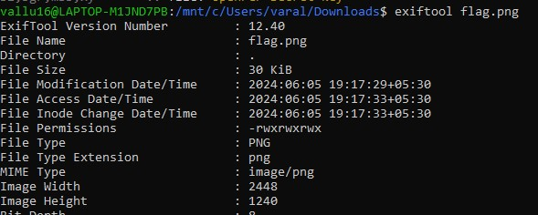
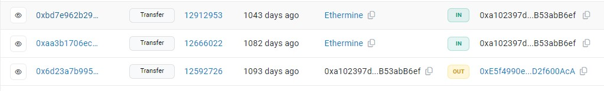
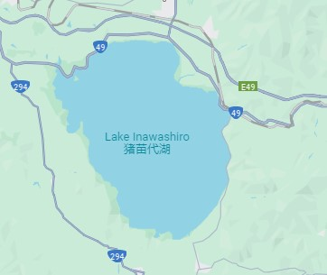
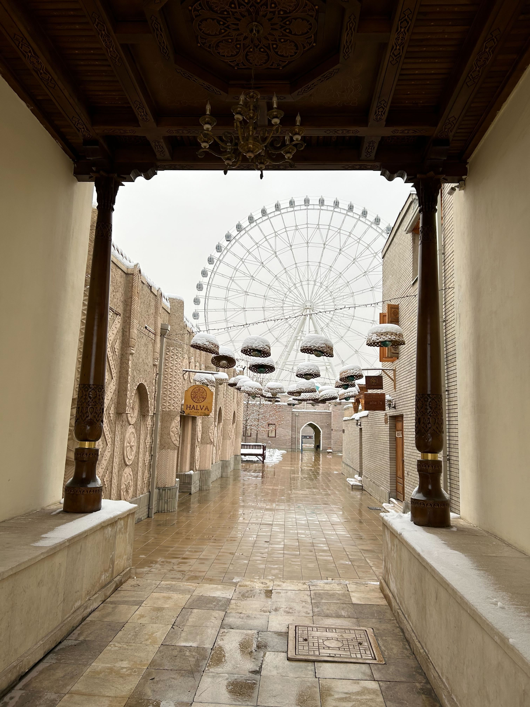

# CHALLENGE 1
## Information
    Commands: file, exiftool
Check from the 'file' command if it is really .jpg file. Then to look for the files info or details I used the 'exiftool' command. In the exiftool I found out long strings.  
  
Trying a random method of converting those strings from base64 and got the flag.
(used this link https://www.base64decode.org/)

    Flag: picoCTF{the_m3tadata_1s_modified}

## Matryoshka Doll
    Commands: file, binwalk, binwalk -e, cat
By using 'binwalk' command, we can see that is has hidden zip files in it. Use 'binwalk -e' command to unzip the files.  
  
Proceed with the same procedure till you get a text file.  
  
Read the text file.  
  

    Flag: picoCTF{96fac089316e094d41ea046900197662}

## tunn3l v1s10n
    Commands:file, xxd, mv, binwalk
Using the file command we get nothing useful. Type 'xxd' command and there we get the initials as 'BM' which denotes a bitmap file. Change the extension of the file by 'mv' command and try to open it. Nothing happens  
  
Open the hex values of the given file. (used this site for hex values https://hexed.it/)  
  
Download a random bitmap image from the browser and compare the initial hex values.  
  
Make the required changes in the hex values by comparing both the files.  
  
Try to open the image and the image opens but we do not get a correct flag.  
  
Using the exiftool look for the details of the file. We can observe a huge difference in the image height ad width.  
  
Open python idle and convert image height and width into hex values and find it in the hex values of the file.  
  
Try all sorts of hex values for the image height till you observe something else.  
  
And yesss... U got the flag  

    Flag: picoCTF{qu1t3_a_v13w_2020}

## MacroHard WeakEdge
    Commands: file, unzip, cat
Use the usual 'file' command. Unzip the .pptm file.  
  
In the last there is a file called hidden. Read the file and you'll get some chracters. Try decoding it from base64.
(used this link https://www.base64decode.org/).... Yess you got the flag.  
  

    Flag: picoCTF{D1d_u_kn0w_ppts_r_z1p5}

## Enhance!
    Commands: binwalk, mv
Changed the name of the downloaded file as per my convenience. Use the command 'binwalk' to check for the file type and extensions. Use 'mv' command to change the file extension.  
  
Open the .xml file in notepad and notice it carefully. It is a flag.  
 

    Flag: picoCTF{3nh4nc3d_24374675}

## Advanced Potion Making
    Commands: file, exiftool, xxd
Tried 'file' and 'exiftool' but got no information. Look for the hex values by 'xxd' command.The initial hex values are similar to that of the .png file (source : https://en.wikipedia.org/wiki/List_of_file_signatures).  
  
Change the hex values to its default value. Look for its height and width and change it accordingly.  
  
  
  
Nothing is useful when we open the file. Use online stegsolve platforms and use its tools.
(https://georgeom.net/StegOnline/image)  
  

    Flag: picoCTF{w1z4rdry}

## File Types
    Commands: file, mv, binwalk, lzip, lzop, lzma, xd
Using the 'file' command we get to know the file is a shell archive. Copy the file and rename the file with extension .sh. Execute the file. There is a uudecode error.  
  
Install uudecode. After installing it works..  
  
Check for the list of files. There is a new file 'flag' in it. Chech its extension using 'file' command. It is an archive file so extract its content using 'binwalk' command. There are multiple compressions so install libraries if not there and keep decompressing. Also rename the file if there is an error occuring due to unknown suffix.  
  
  
  
  
  
Ascii text is given in the last file. Convert it from base64 or hex values to get the flag. Hex conversion works.  

    Flag: picoCTF{f1len@m3_m@n1pul@t10n_f0r_0b2cur17y_3c79c5ba}

## HIDEME
    Commands: file, exiftool, binwalk, unzip
Start with the regular and most common commands. By 'binwalk' command we get to know a there is another image inside this image in a zip file.  
Unzip it and go to the secret folder to open the image.  
  
  
  
  

    Flag: picoCTF{Hiddinng_An_imag3_within_@n_ima9e_96539bea}

## MSB
    Commands: python3, ls
Firstly I tried all sorts of methods like using commands that are used for steganography and visiting online platforms for steganography.  
On the online steganography platforms, solving via LSB is given but not for MSB. I searched for the code online to get the data through MSB(as the name of the challenge says) and got this github link (https://github.com/Pulho/sigBits).  
  
I copied the code in my vscode and executed it on my terminal as per the given instructions.  
  
Then I opened the file and by the 'find' method found the flag.  
  

    Flag: picoCTF{15_y0ur_que57_qu1x071c_0r_h3r01c_ee3cb4d8}

## Extensions
    Commands: file, mv
Using the 'file' command know about the extension of the file and change it using 'mv' command if different.  
  
  

    Flag: picoCTF{now_you_know_about_extensions}

# CHALLENGE 2 - Try Hack Me
## TIP - OFF
Copy the URL given and use 'wget' command to save the file.  
  
By the given instructions we have to find out the information of the file. Use 'exiftool' to do so.  

    Flag: SakuraSnowAngelAiko

## RECONNAISSANCE
Search the username on the web and you'll find two accounts for the same username. One for github and the other of twitter.  
  
Open the github account and look for the repositories. Apart from the repos that are forked look at the remaining ones. There is a private key in the PGP repo. Copy the raw data URL.   
  
Curl the URL and proceed with 'gpg' to manage the PGP keys.  
 

    Flag 1: SakuraSnowAngel83@protonmail.com

Now open the twitter profile of the given username. 
Look at the posts and there you can find the full name of the attacker.  
  

    Flag 2: Aiko Abe

## UNVEIL
Look for the repos serial wise. Open the ETH repo and check for commits.  
  
Look for the data on the web.  
  

    Flag 1: Ethereum
    Flag 2: 0xa102397dbeeBeFD8cD2F73A89122fCdB53abB6ef
Go to https://etherscan.io/ to scan for wallet id  
  
  

    Flag 3: Ethermine
    Flag 4: Tether

## TAUNT
Look at the username of the twitter account previously found.  
  

    Flag 1: SakuraLoverAiko
Look at the hint of the question. There you'll find the required URL.  
  

    Flag 2: http://deepv2w7p33xa4pwxzwi2ps4j62gfxpyp44ezjbmpttxz3owlsp4ljid.onion
Given the hint, regitser yourself on https://wigle.net/ and look for advanced search. Enter the SSID of the home wifi to get BSSID.  
  

    Flag 3: 84:AF:EC:34:FC:F8

## HOMEBOUND
Search the nearest airport to the given location in the post.  
  
  

    Flag 1: DCA
Look at the post of the attacker's ladt layover. Web search for the 'Sakura Lounge'.  
  
  

    Flag 2: HND
Web search the given image and you'll find the name of the city is Niigata in Japan. Open the google maps and look fot it. Move towards the right and you will see the lake asked.  
  

    Flag 3:Lake Inawashiro
As per the wifi details given in the last question the city mentioned is 'HIROSAKI'  
  

    Flag 4: Hirosaki

# CHALLENGE 2 - Gralhix
## EXERCISE #006
Using the google lens look for the exact image. There is a news report with the same image of bomb blast in Iraq.  
(source: https://www.iraqinews.com/iraq-war/8-people-killed-wounded-bomb-blast-near-shops-south-baghdad/)  

    ANSWER: NO
## EXERCISE #004
Web search the given image. You'll get the a wix site with the exact image.  
(source: https://oanresort.wixsite.com/chuuk/about)  
Search for the island on which Oan Resort is there and look for its coordinates.  
Go to Google Earth and set the island exactly given in the image to now the direction of the camera. The position at which we have stopped is around 320 deg from north.  
  

    ANSWER: a) Oan Resort
            b) 7.4469° N, 151.7473° E
            c) North West
## EXERCISE #003
Web search the event and there will be several news articles on the same. One of them tells us about the place.  
(source: https://www.tccb.gov.tr/en/news/542/74924/somali-cumhurbaskani-muhammed-cumhurbaskanligi-kulliyesinde)  

    ANSWER: a) Presidential Complex, Turkey
            b) 39.9308°N 32.7989°E
## EXERCISE #014
Search the date, time for the earthquake details. Got https://www.romania-insider.com/5-3-magnitude-earthquake-shakes-romania-friday-night news article which mentions about the earthquake.  
  
Search for the white building in the video to get the place and verify the place with the news article. The place is Artrium (Chisinau, Moldova).  
  
  
Make exactly the same scene on Google Earth to get the coordinates.  
  

    ANSWER: a) 5.6
            b) 47°00'56"N 28°51'14"E
## EXERCISE #026
Search the images serial wise. This will help to tell the journey as the pictures seem to be from the gallery of the person according to the file names.  
First Image is of Chorsu Bazaar, Tashkent, Uzbekistan.  
  
Second Image is infront of the Anhor Lokomotiv Park, Tashkent, Uzbekistan.  
  
Finding the place in the third image is difficult. There are many clues but the final one is 'rent a car'. Search for it in google street view in Tashkent. Try to look for the shop next to wide roads. The shop we are looking for is Orient rent a car. Look at the street view of it and you'll find the required place. 
 
Next we are supposed to look at the nearest railway station to this place. Search for it. 
 
 
Fourth place isn't easy to find. There are no landmarks given in the picture. I searched for 'yellow cars near Tashkent Uzbekistan' and I got this. 
 
Samarkand.....Interesting. Next I searched for parking areas in Samarkand and looked at almost all of them just next to the road. 
 
 
 

    ANSWERS: a) Stantsiya Tashkent Station
             b) On foot in all the other images
             c) Afrosiyob Train
             d) 210 km/hr
             e) 11.3 + 332 = 343.3 km

