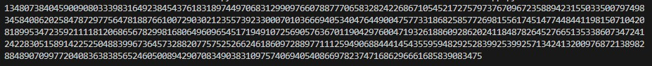

# CHALLENGE 1
Open the source code and decode it from base64. <br>
**SCRIPT:**
```
from base64 import *

msg = "d2l0aCBvcGVuKCdmbGFnLnR4dCcsICdyJykgYXMgZjoKICAgIGZsYWcgPSBmLnJlYWQoKQoKcyA9ICcnLmpvaW4oZm9ybWF0KG9yZChpKSwgJzAyeCcpIGZvciBpIGluIGZsYWcpCmUgPSAiIgoKZm9yIGkgaW4gcmFuZ2UoMCxsZW4ocyksNCk6CiAgICBlICs9IGZvcm1hdChpbnQoc1tpOmkrMl0sMTYpXmludChzW2k6aSs0XSwxNiksICcwMngnKQoKd2l0aCBvcGVuKCdvdXRwdXQudHh0JywgJ3cnKSBhcyBmOgogICAgZi53cml0ZShlKQ=="

print (b64decode(msg).decode())
```
**OUTPUT:** <br>
<br>
Try to reverse the given code to get the value of the flag.
Break the output hex value into a list of elements("02x") and convert them into decimal. The first number remains the same but the second one is the xor of the first and second number. Reverse the xor to get the second number. Keep on adding the corresponding character of the numbers to the string.<br>
**SCRIPT:**
```
# From output.txt
msg = "43104f0c32017b48340179266203350636025f6b6e0a5f2730423f42"

msg_list=[int(msg[i:i+2], 16) for i in range(0, len(msg), 2)]
# msg_list= [67, 16, 79, 12, 50, 1, 123, 72, 52, 1, 121, 38, 98, 3, 53, 6, 54, 2, 95, 107, 110, 10, 95, 39, 48, 66, 63, 66]

flag=""
for i in range (1,len(msg_list),2):
    flag+=chr(msg_list[i-1])
    flag+=chr(msg_list[i-1]^msg_list[i])

print(flag)
```

**OUTPUT:** <br>
    

    FLAG: CSOC23{345y_ba5364_4nd_x0r?}
# CHALLENGE 2
As given in the 'encoded.txt' file we can observe the pattern. The message is encoded in binary, hexadecimal, base64 and octal form. Decode the same.<br>
**SCRIPT:**
```
# msg = 01000011 01010011 01001111 01000011 00110010 33 7b 6a 75 35 37 5f ZDFmZjNyM243XzNuYw== 60 144 61 156 66 65 137 154 60 154 175
from base64 import *

msg_binary = "01000011 01010011 01001111 01000011 00110010"
msg_hex = "33 7b 6a 75 35 37 5f"
msg_base64 = "ZDFmZjNyM243XzNuYw=="
msg_octal = "60 144 61 156 66 65 137 154 60 154 175"

flag_bin="".join(chr(int(b,2)) for b in msg_binary.split()) # Decoding binary form
flag_hex="".join(chr(int(h,16)) for h in msg_hex.split())   # Decoding hexadecimal form
flag_64=(b64decode(msg_base64)).decode()                    # Decoding base64 form
flag_oct="".join(chr(int(o,8)) for o in msg_octal.split())  # Decoding octal form

flag = flag_bin + flag_hex + flag_64 + flag_oct             # Concatenating all the flags.
print(flag)
```
**OUTPUT:** <br>


    FLAG: CSOC23{ju57_d1ff3r3n7_3nc0d1n65_l0l}

# CRYPTOHACK: INTRODUCTION
## Finding Flags
Copy paste the given flag in the question. <br>
    
    FLAG: crypto{y0ur_f1rst_fl4g}

## Great Snakes
Run the attached python file in the question to get the flag.<br>
**SCRIPT**:<br>
```
#!/usr/bin/env python3

import sys
# import this

if sys.version_info.major == 2:
    print("You are running Python 2, which is no longer supported. Please update to Python 3.")

ords = [81, 64, 75, 66, 70, 93, 73, 72, 1, 92, 109, 2, 84, 109, 66, 75, 70, 90, 2, 92, 79]

print("Here is your flag:")
print("".join(chr(o ^ 0x32) for o in ords))
```
**OUTPUT:** <br>


    FLAG: crypto{z3n_0f_pyth0n}

## Network Attacks
Download the python file and change the value of the key 'buy' to 'flag'. <br>
**SCRIPT:**
```
#!/usr/bin/env python3

from pwn import * # pip install pwntools
import json

HOST = "socket.cryptohack.org"
PORT = 11112

r = remote(HOST, PORT)


def json_recv():
    line = r.readline()
    return json.loads(line.decode())

def json_send(hsh):
    request = json.dumps(hsh).encode()
    r.sendline(request)


print(r.readline())
print(r.readline())
print(r.readline())
print(r.readline())

request = {
    "buy": "flag"   # Change the value
}
json_send(request)
response = json_recv()
print(response)
```
**OUTPUT:**<br>
<br>

    FLAG: crypto{sh0pp1ng_f0r_fl4g5}

# CRYPTOHACK: GENERAL
## ENCODING: ASCII
Decode the ASCII values given in the question into characters.<br>
**SCRIPT:**
```
A = [99, 114, 121, 112, 116, 111, 123, 65, 83, 67, 73, 73, 95, 112, 114, 49, 110, 116, 52, 98, 108, 51, 125]

for i in A:
    print(chr(i),end="")
```
**OUTPUT:** <br>


    FLAG: crypto{ASCII_pr1nt4bl3}

## ENCODING: Hex
Decode the given msg from hex form to bytes.<br>
**SCRIPT:**
```
H="63727970746f7b596f755f77696c6c5f62655f776f726b696e675f776974685f6865785f737472696e67735f615f6c6f747d"

print(bytes.fromhex(H))
```
**OUTPUT:** <br>


    FLAG: crypto{You_will_be_working_with_hex_strings_a_lot}

## ENCODING: Base64
Decode the hex string as given in the question. Convert it into bytes and then decode from base64.<br>
**SCRIPT:**
```
import base64

hex_str="72bca9b68fc16ac7beeb8f849dca1d8a783e8acf9679bf9269f7bf"

byte_str=bytes.fromhex(hex_str)
base64_str=base64.b64encode(byte_str)
print(base64_str)
```
**OUTPUT:** <br>


    FLAG: crypto/Base+64+Encoding+is+Web+Safe/

## ENCODING: Bytes and Big Integers
Convert the given message from long to bytes.<br>
**SCRIPT:**
```
from Crypto.Util.number import *

msg = 11515195063862318899931685488813747395775516287289682636499965282714637259206269

print(long_to_bytes(msg))
```
**OUTPUT:** <br>


    FLAG: crypto{3nc0d1n6_4ll_7h3_w4y_d0wn}

## XOR: XOR Starter
For each letter in the given string, convert it into its ascii value and XOR with 13. Change the resulting number to the character.<br>
**SCRIPT:**
```
import pwn

given_str="label"
final_str=""
for i in given_str:
    num=ord(i)
    after_xor=num^13
    final_str+=chr(after_xor)

print("crypto{"+final_str+"}")
```
**OUTPUT:** <br>


    FLAG: crypto{aloha}

## XOR: XOR Properties
Use the XOR properties of associativity and reverse to get the separate key and flag values.<br>
**SCRIPT:**
```
from Crypto.Util.number import *

KEY1 = "a6c8b6733c9b22de7bc0253266a3867df55acde8635e19c73313"
key1 = bytes_to_long(bytes.fromhex(KEY1))

KEY2_KEY1="37dcb292030faa90d07eec17e3b1c6d8daf94c35d4c9191a5e1e"
key2_key1=bytes_to_long(bytes.fromhex(KEY2_KEY1))
key2 = key2_key1 ^ key1

KEY2_KEY3 = "c1545756687e7573db23aa1c3452a098b71a7fbf0fddddde5fc1"
key2_key3 = bytes_to_long(bytes.fromhex(KEY2_KEY3))
key3 = key2_key3 ^ key2

FLAG_KEY1_KEY2_KEY3 = "04ee9855208a2cd59091d04767ae47963170d1660df7f56f5faf"
flag_key1_key2_key3 = bytes_to_long(bytes.fromhex(FLAG_KEY1_KEY2_KEY3))
flag=flag_key1_key2_key3 ^ key1 ^ key2 ^ key3

print(long_to_bytes(flag))
```
**OUTPUT:** <br>


    FLAG: crypto{x0r_i5_ass0c1at1v3}

## XOR: Favourite byte
The range is defined in the question. We are suppose to use brute force approach to check for the flag after we XOR each byte of the message with the number(secret key). Firstly change the hex message to bytes, XOR it and join in the string. Check if the flag found starts with 'crypto' to know the original flag.<br>
**SCRIPT:**
```
from Crypto.Util.number import *

msg_hex = "73626960647f6b206821204f21254f7d694f7624662065622127234f726927756d"

msg_byte = [m for m in bytes.fromhex(msg_hex)]

for i in range (256):
    flag_xord=[i^m for m in msg_byte]
    flag="".join(chr(m) for m in flag_xord)
    if flag.startswith("crypto"):
        break

print(flag)
```
**OUTPUT:** <br>


    FLAG: crypto{0x10_15_my_f4v0ur173_by7e}

## XOR: You either know, XOR you don't
No clue for the secret key is given. We know the initials of our flag. Using xor properties get the first 7 letters of the key. <br>
**SCRIPT:**
```
from pwn import *

msg_hex = "0e0b213f26041e480b26217f27342e175d0e070a3c5b103e2526217f27342e175d0e077e263451150104"

# msg^key=flag --> msg^flag=key
msg_byte = bytes.fromhex(msg_hex)   # convert the hex message into bytes
flag = "crypto{"
result = xor(msg_byte[:7], flag.encode()) # myXORke

key = "myXORkey"    # Completed the key as per the result and adding 'y' to complete it.
key = (key* (len(msg_byte)//len(key)+1))    # Making the length of the key a little greater than the actual
                                            # length of message so that it can be xor'd with the message.
flag = xor(key[:len(msg_byte)].encode(),msg_byte)
print(flag.decode())
```
**OUTPUT:** <br>'


    FLAG: crypto{1f_y0u_Kn0w_En0uGH_y0u_Kn0w_1t_4ll}

## MATHEMATICS: Greatest Common Divisor
Let a be the smaller number, and apply the algorithm to find GCD.<br>
**SCRIPT:**
```
def gcd(a,b):
    while(b!=0):
        t=b
        b=a%b
        a=t
    return a

a = 66528
b = 52920
if(a<b):
    a,b=b,a

print(gcd(a,b))
```
**OUTPUT:** <br>


    ANSWER: 1512

## MATHEMATICS: Extended GCD
Followed the Extended Euclidean Algorithm and the table provided to write the code.<br>
(source: https://en.wikipedia.org/wiki/Extended_Euclidean_algorithm)
<br>
**SCRIPT:**
```
def xgcd(r0,r1):
    q= r0//r1
    s0,s1=1,0
    t0,t1=0,1
    while(r1!=0):
        q=r0//r1

        r0,r1 = r1, r0-q*r1

        s0,s1 = s1, s0-q*s1

        t0,t1 = t1, t0-q*t1
    print(f"GCD: {r0}, u: {s0}, v: {t0}")

a = 26513
b = 32321
xgcd(a,b)
```
**OUTPUT:** <br>


    ANSWER: -8404

## MATHEMATICS: Modular Arithmetic 1
Find the remainder by the modulus operator.<br>
**SCRIPT:**
```
# 11 ≡ x mod 6
# 8146798528947 ≡ y mod 17

x = 11%6
y = 8146798528947 % 17

print(f"x = {x}, y = {y}")
```
**OUTPUT:** <br>


    ANSWER: 4

## MATHEMATICS: Modular Arithmetic 2
**REASON:** According to **Fermat's little theorem**, let 'p' be a prime then a raise to the power p-1 mod p where a is not divisible by p is equal to **1**. <br>

    ANSWER: 1

## MATHEMATICS: Modular Inverting
**SCRIPT:**
```
# Fermat Theorem: a^(p-1) ≡ 1 (mod p)
# 3 * 3^(p-2) ≡ 1 (mod 13)

print(f"ANSWER : {(3**11)%13}")
```
**OUTPUT:** <br>


    ANSWER: 9

# CRYPTOHACK: SYMMETRIC CIPHERS
##  HOW AES WORKS: Keyed Permutations
Web search the question.

    ANSWER: crypto{bijection}

##  HOW AES WORKS: Resisting Bruteforce
Web search the question.

    ANSWER: crypto{biclique}

##  HOW AES WORKS: Structure of AES
**SCRIPT:**
```
def bytes2matrix(text):
    """ Converts a 16-byte array into a 4x4 matrix.  """
    return [list(text[i:i+4]) for i in range(0, len(text), 4)]

def matrix2bytes(matrix):
    """ Converts a 4x4 matrix into a 16-byte array. """
    flag = ""
    for i in range(4):
        for j in range (4):
            flag+=chr(matrix[i][j]) # Iterating through each element of matrix and converting into character
    return flag

matrix = [
    [99, 114, 121, 112],
    [116, 111, 123, 105],
    [110, 109, 97, 116],
    [114, 105, 120, 125],
]

print(matrix2bytes(matrix))
```
**OUTPUT:** <br>


    FLAG: crypto{inmatrix}

# CRYPTOHACK: RSA
## STARTER: RSA Starter 1
**SCRIPT:**
```
# 101^17 mod 22663
# pow(base, exponent, modulus)

print(pow(101, 17, 22663))
```
**OUTPUT:** <br>


    FLAG: 19906

## STARTER: RSA Starter 2
**SCRIPT:**
```
# pow(base, exponent, modulus)
# pow (m, e, N)
# N = p*q

m = 12
e = 65537
p,q= 17,23
N= p*q

print(pow(m, e, N))
```
**OUTPUT:** <br>


    FLAG: 301

## STARTER: RSA Starter 3
**SCRIPT:**
```
# Totient of N is (p-1)*(q-1)
p = 857504083339712752489993810777
q = 1029224947942998075080348647219

print(f"Totient of N: {(p-1)*(q-1)}")
```
**OUTPUT:** <br>


    FLAG: 882564595536224140639625987657529300394956519977044270821168

## STARTER: RSA Starter 4
**SCRIPT:**
```
p = 857504083339712752489993810777
q = 1029224947942998075080348647219
TN = (p-1)*(q-1)
e = 65537

ans = pow(e, -1, TN)    # inverse

print(f"Private Key: {ans}")
```
**OUTPUT:** <br>


    FLAG: 121832886702415731577073962957377780195510499965398469843281

## STARTER: RSA Starter 5
**SCRIPT:**
```
N = 882564595536224140639625987659416029426239230804614613279163
e = 65537
c = 77578995801157823671636298847186723593814843845525223303932
p = 857504083339712752489993810777
q = 1029224947942998075080348647219
TN = (p-1)*(q-1)
d = pow(e, -1, TN)  # private key

ans = pow(c ,d, N)

print(f"ANSWER: {ans}")
```
**OUTPUT:** <br>


    FLAG: 13371337

## STARTER: RSA Starter 6
Read the values from the private key file. <br>
<br>
**SCRIPT:**
```
from Crypto.Util.number import *
import hashlib

msg = "crypto{Immut4ble_m3ssag1ng}"
msg_bytes = msg.encode()    # convert the message to bytes
msg_hash = hashlib.sha256(msg_bytes).digest()   # Change the message into its hash value
msg_hash_long = bytes_to_long(msg_hash)     # Convert the hash value to integer
N = 15216583654836731327639981224133918855895948374072384050848479908982286890731769486609085918857664046075375253168955058743185664390273058074450390236774324903305663479046566232967297765731625328029814055635316002591227570271271445226094919864475407884459980489638001092788574811554149774028950310695112688723853763743238753349782508121985338746755237819373178699343135091783992299561827389745132880022259873387524273298850340648779897909381979714026837172003953221052431217940632552930880000919436507245150726543040714721553361063311954285289857582079880295199632757829525723874753306371990452491305564061051059885803
d = 11175901210643014262548222473449533091378848269490518850474399681690547281665059317155831692300453197335735728459259392366823302405685389586883670043744683993709123180805154631088513521456979317628012721881537154107239389466063136007337120599915456659758559300673444689263854921332185562706707573660658164991098457874495054854491474065039621922972671588299315846306069845169959451250821044417886630346229021305410340100401530146135418806544340908355106582089082980533651095594192031411679866134256418292249592135441145384466261279428795408721990564658703903787956958168449841491667690491585550160457893350536334242689

sign = pow(msg_hash_long, d, N)

print(sign)
```
**OUTPUT:** <br>


    FLAG: 13480738404590090803339831649238454376183189744970683129909766078877706583282422686710545217275797376709672358894231550335007974983458408620258478729775647818876610072903021235573923300070103666940534047644900475773318682585772698155617451477448441198150710420345840862025847872977564781881899534723592111181206865678299816806496096545171949107256905763670119042976004719326188609286202411848782645276651353386073472418299816806496096545171949107242283051589142252504883996736457328820775752526624618609728897711125949068844414543559594829252839925399257134241320097687213898297288977111259490688444145438848907099772040836383856524605008942907083490383109757406940540866978237471686296661685839083475 

# PUBLIC EXPONENT: Salty
Get the values of N, e , ct from the output file and print the value of ct in readable form.<br>
**SCRIPT:**
```
from Crypto.Util.number import *

n = 110581795715958566206600392161360212579669637391437097703685154237017351570464767725324182051199901920318211290404777259728923614917211291562555864753005179326101890427669819834642007924406862482343614488768256951616086287044725034412802176312273081322195866046098595306261781788276570920467840172004530873767         
e = 1
ct = 44981230718212183604274785925793145442655465025264554046028251311164494127485

print(long_to_bytes(ct))
```
**OUPUT:** <br>


    FLAG: crypto{saltstack_fell_for_this!}

