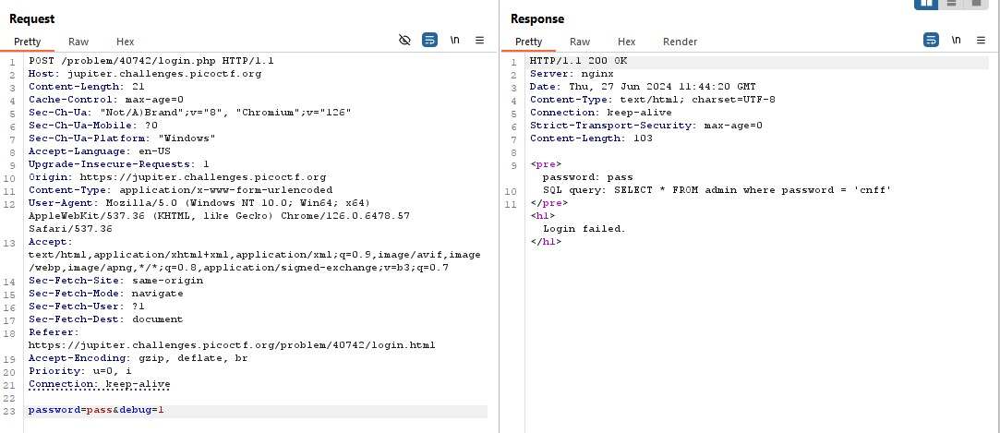

# Web Gauntlet
Open both the websites.<br>
**Round1: or** <br>
Try to login as **admin**  <br>
  <br>
As we can see from the SQL query AND is being used. If we can use OR or comment the rest of it then we can login with any password. We cannot use OR as mentioned in filter section. <br>
 <br>
Type in username: **admin'--** <br>
 <br>
Refresh the filter.php page. <br>
**Round2: or and like = --** <br>
We cannot use single line comment method now as it is now mentioned in filter. Try to end the statement by **;** <br>
Type in username: **admin';** <br>
 <br>
**Round3: or and = like > < --** <br>
We can still use this **;** to end the command. <br>
Type in username: **admin';** <br>
 <br>
**Round4: or and = like > < -- admin** <br>
Now we cannot use **admin** in our username as it fill get filtered. To login as admin we can concatenate two strings which make up 'admin'. <br>
 <br>
Type in username: **ad'||'min';** <br>
 <br>
**Round5: or and = like > < -- union admin** <br>
As we haven't used 'union' in the previous command, we can still use "||" operator to concatenate strings. <br>
<br>

Refresh the page to get the following code and the flag. <br>
```
<?php
session_start();

if (!isset($_SESSION["round"])) {
    $_SESSION["round"] = 1;
}
$round = $_SESSION["round"];
$filter = array("");
$view = ($_SERVER["PHP_SELF"] == "/filter.php");

if ($round === 1) {
    $filter = array("or");
    if ($view) {
        echo "Round1: ".implode(" ", $filter)."<br/>";
    }
} else if ($round === 2) {
    $filter = array("or", "and", "like", "=", "--");
    if ($view) {
        echo "Round2: ".implode(" ", $filter)."<br/>";
    }
} else if ($round === 3) {
    $filter = array(" ", "or", "and", "=", "like", ">", "<", "--");
    // $filter = array("or", "and", "=", "like", "union", "select", "insert", "delete", "if", "else", "true", "false", "admin");
    if ($view) {
        echo "Round3: ".implode(" ", $filter)."<br/>";
    }
} else if ($round === 4) {
    $filter = array(" ", "or", "and", "=", "like", ">", "<", "--", "admin");
    // $filter = array(" ", "/**/", "--", "or", "and", "=", "like", "union", "select", "insert", "delete", "if", "else", "true", "false", "admin");
    if ($view) {
        echo "Round4: ".implode(" ", $filter)."<br/>";
    }
} else if ($round === 5) {
    $filter = array(" ", "or", "and", "=", "like", ">", "<", "--", "union", "admin");
    // $filter = array("0", "unhex", "char", "/*", "*/", "--", "or", "and", "=", "like", "union", "select", "insert", "delete", "if", "else", "true", "false", "admin");
    if ($view) {
        echo "Round5: ".implode(" ", $filter)."<br/>";
    }
} else if ($round >= 6) {
    if ($view) {
        highlight_file("filter.php");
    }
} else {
    $_SESSION["round"] = 1;
}

// picoCTF{y0u_m4d3_1t_a5f58d5564fce237fbcc978af033c11b}
?>
```

    FLAG: picoCTF{y0u_m4d3_1t_a5f58d5564fce237fbcc978af033c11b}

# Web Gauntlet 2
Filters: or and true false union like = > < ; -- /* */ admin <BR>
We cannot end or comment after the username but we can make password true. We cannot use **true** keyword but we can use **IS NOT** to make the value true.<br>
Type in username: **ad'||'min** <br>
Type in password: **1' IS NOT '2** <br>


```
<?php
session_start();

if (!isset($_SESSION["winner2"])) {
    $_SESSION["winner2"] = 0;
}
$win = $_SESSION["winner2"];
$view = ($_SERVER["PHP_SELF"] == "/filter.php");

if ($win === 0) {
    $filter = array("or", "and", "true", "false", "union", "like", "=", ">", "<", ";", "--", "/*", "*/", "admin");
    if ($view) {
        echo "Filters: ".implode(" ", $filter)."<br/>";
    }
} else if ($win === 1) {
    if ($view) {
        highlight_file("filter.php");
    }
    $_SESSION["winner2"] = 0;        // <- Don't refresh!
} else {
    $_SESSION["winner2"] = 0;
}

// picoCTF{0n3_m0r3_t1m3_838ec9084e6e0a65e4632329e7abc585}
?>
```

    FLAG: picoCTF{0n3_m0r3_t1m3_838ec9084e6e0a65e4632329e7abc585}
# Web Gauntlet 3
Filters: or and true false union like = > < ; -- /* */ admin <br>
We cannot end or comment after the username but we can make password true. We cannot use **true** keyword but we can use **IS NOT** to make the value true.<br>
Type in username: **ad'||'min** <br>
Type in password: **1' IS NOT '2** <br>

```
<?php
session_start();

if (!isset($_SESSION["winner3"])) {
    $_SESSION["winner3"] = 0;
}
$win = $_SESSION["winner3"];
$view = ($_SERVER["PHP_SELF"] == "/filter.php");

if ($win === 0) {
    $filter = array("or", "and", "true", "false", "union", "like", "=", ">", "<", ";", "--", "/*", "*/", "admin");
    if ($view) {
        echo "Filters: ".implode(" ", $filter)."<br/>";
    }
} else if ($win === 1) {
    if ($view) {
        highlight_file("filter.php");
    }
    $_SESSION["winner3"] = 0;        // <- Don't refresh!
} else {
    $_SESSION["winner3"] = 0;
}

// picoCTF{k3ep_1t_sh0rt_2a78ea34c84da0bf585ada4cb9a6f8fb}
?>
```

    FLAG: picoCTF{k3ep_1t_sh0rt_2a78ea34c84da0bf585ada4cb9a6f8fb}
# Irish-Name-Repo 1
As you go to the support section you'll get to know that SQL database it used. End the SQL command just after checking the username. <BR>
Type in username: **admin';** <br>
 <br>
 <br>

    FLAG: picoCTF{s0m3_SQL_fb3fe2ad}
# Irish-Name-Repo 2
It is given that the password is being filtered. We can still use our previous username. <br>
Type in username: **admin';** <br>
 <br>

    FLAG: picoCTF{m0R3_SQL_plz_c34df170}
# Irish-Name-Repo 3
Open the site in burpsuite and try any password. Go to the HTTP history and send the request to the repeater and observe. It is showing as 'Login Failed'. <br>
 <br>
The value of debug is 0, make it 1. <br>
 <br>
We can see that the password is getting encoded in some pattern. Enter the value such that password becomes true. Copy the encoded form of that value and enter that as the password further. <br>
 <br>
 <br>

    FLAG: picoCTF{3v3n_m0r3_SQL_4424e7af}
# JAWT Scratchpad
As you open the link it asks for a username. You cannot login as the admin so type any username for now. In the cookies section, check for the available cookies. <br>
 <br>
Search for the JWT debugger on the browser (https://jwt.io/). Copy paste the value of the cookie on the given site. <br>
 <br>
The name of the user can easily be changed to 'admin' but after copying the changed value to the site, it isn't opening. So we need to first find the secret code. Bruteforcing might help. There is a clue on the site about usijg JohnTheRipper for cracking the secret code. Use it to get the code. <br>
 <br>
The secret code is : ilovepico <br>
Type in the secret code and change the user as well to 'admin'. <br>
 <br>
You'll get a new value. Paste it in the jwt section of cookies. Admin page is opened. <br>
 <br>

    FLAG: picoCTF{jawt_was_just_what_you_thought_44c752f5}
# Secrets

Open the link (http://saturn.picoctf.net:56722/) given in the question and inspect it. You can see a 'secret' folder in the sources question. <br>
 <br>
Change the url by adding 'secret/' at the end of it.
(http://saturn.picoctf.net:56722/secret/). Similarly add 'hidden' and 'superhidden' to the url. <br>
 <br>
 <br>
Here you can observe that the message says that the flag is found but it is hidden. Check the elements. And there it is... the flag. <br>
 <br>
 <br>

    FLAG: picoCTF{succ3ss_@h3n1c@10n_39849bcf}
# Client-side-again

Open the given link (https://jupiter.challenges.picoctf.org/problem/6353/) and click on the 'view source page'. <br>
<br>
Make the code prettier and replace the complex variable names to english uppercase alphabets (to read code easily) and change the base16 values into decimal form.
<br>
We get to know that the array is being rotated by the first function. Print the value at the 0th index of the array to know the sequence.
<br>
Replace the values from the function FUN and calculate the slicing values. Write the password yourself from the sliced values given in the 'if' conditions of the code such that the password is correct.<br>

```
var A=['0a029}','_again_5','this','Password\x20Verified','Incorrect\x20password','getElementById','value','substring','picoCTF{','not_this'];

(function(B,C){
    var D=function(F){
        while(--F){
            B['push'](B['shift']());
        }
    };
    D(++C);
}(A,435));      // 0x1b3 = 435

var FUN=function(G){
    G=G-0;
    var I=A[G];
    return I;
};
function verify(){
    checkpass=document[FUN('0')]('pass')[FUN('1')];     //checkpass = document[getElementById]('pass')[value];
    split=4;
    if(checkpass[FUN('2')](0,8)==FUN('3')){                                       // FUN('3') = 'picoCTF{'
        if(checkpass[FUN('2')](7,9)=='{n'){                                       //            '{n'
            if(checkpass[FUN('2')](8,16)==FUN('4')){                              // FUN('4') = 'not_this'
                if(checkpass[FUN('2')](3,6)=='oCT'){                              //            'OCT'
                    if(checkpass[FUN('2')](24,32)==FUN('5')){                     // FUN('5') = '0a029}'
                        if(checkpass['substring'](6,11)=='F{not'){                //            'F{not'
                            if(checkpass[FUN('2')](16,24)==FUN('6')){             // FUN('6') = '_again_5'
                                if(checkpass[FUN('2')](12,16)==FUN('7')){         // FUN('7') = 'this'
                                    alert(FUN('8'));        // FUN('7') = 'Password Verified'
                                }
                            }
                        }
                    }
                }
            }
        }
    }
    else{alert(FUN('9'));       // FUN('9') = 'Incorrect Password'
    }
}

console.log(FUN('0'));

// PASSWORD = 'picoCTF{not_this_again_50a029}'

```

    FLAG: picoCTF{not_this_again_50a029}
# Who-are-you?

Open this site in the burpsuite and send it to the repeater. <br>
"Only people who use the official PicoBrowser are allowed on this site!"<br>
Make the changes as highlighted in the image.<br>
<br>
"I don&#39;t trust users visiting from another site." <br>
Search for the header used to refer to a particular site.<br>
<br>
"Sorry, this site only worked in 2018." <br>
Add a 'DATE' header for a date in 2018.<br>
<br>
"I don&#39;t trust users who can be tracked." <br>
Set Do not track header to 1.<br>
<br>
"This website is only for people from Sweden." <br>
Search any IP address of Sweden and add it.<br>
<br>
"You&#39;re in Sweden but you don&#39;t speak Swedish?" <br>
Add the header for the language of Sweden.<br>
<br>
<br>

FLAG: picoCTF{http_h34d3rs_v3ry_c0Ol_much_w0w_0c0db339}
# Intro to burp
As given in the hint open the link in the burpsuite. Enter your details and then enter OTP. <br>
<br>
<br>
It seems to be an invalid OTP. Go to the HTTP requests section and select the last request. Forward it to the repeater.<br>
<br>
Delete the header containing OTP.<br>
<br>

    FLAG: picoCTF{#0TP_Bypvss_SuCc3$S_c94b61ac}
# JavaScript Kiddie
Get the bytes value from the HTTP history <br>
 <br>
Paste this values in the javascript code and remove this line of code. <br>
```
$.get("bytes", function(resp) {
	bytes = Array.from(resp.split(" "), x => Number(x));
});
```

Let us look into the javascript code. <br>
```
<html>
	<head>    
		<script src="jquery-3.3.1.min.js"></script>
		<script>
			var bytes = [156,255,80,255,117,10,239,248,152,253,120,232,36,127,116,255,151,235,25,172,215,0,56,102,219,174,30,15,36,188,93,90,249,36,32,45,123,73,191,151,236,241,151,68,144,250,157,130,1,180,20,85,213,2,157,248,68,255,250,13,60,66,249,82,187,157,29,222,29,30,0,252,126,251,95,0,174,72,194,108,29,101,70,21,121,40,26,132,73,119,254,237,73,192,96,219,137,80,89,71,0,145,1,152,0,69,254,71,0,65,68,35,0,0,119,114,13,222,68,119,1,0,78,40,155,111,95,90,164,0,26,2,0,245,186,0,84,0,0,233,145,46,110,49,48,16,78,223,135,64,197,10,0,120,0,243,252,62,144,188,21,61,1,110,148,208,22,114,160,31,156,17,45,59,72,237,74,218,0,8,32,123,136,65,179,150,32,56,206,43,240,9,156,225,69,54,226,158,106,148,62,48,1,232,173,0,239,248,243,206,82,255,241,252,56,55,152,132,108,181,78,254,175,251,60,183,38,231,63,123,204,48,43,13,131,4,113,75,243,215,32,200,144,195,29,233,196,63,3,190,139,207,89,28,107,159,185,101,59,120,121,12,245,116,64,96,250,187,241,234,231,207,213,239,119,191,233,71,205,127,144,40,251,253,173,186,246,10,227,252,202,242,163,74,237,33,75,49,205,74,154,165,126,231,30,231,232,199,118,65,211,98,204,7,250,244,141,155,243,123,82,137,252,35,183,201,132,91,252,37,244,56,188,86,125,103,216,248,215,146,144,149,21,164,233,219,127,127,207,208,30,154,111,203,63,127,141,231,146,5,20,4,81,239,38,36,19,191,63,61,183,223,215,205,210,239,168,135,148,201,39,248,212,191,160,151,116,19,150,99,249,141,111,188,0,225,193,61,73,140,160,56,23,53,48,5,99,100,175,250,125,151,253,12,150,85,41,72,206,97,52,79,88,196,130,26,157,254,185,181,42,146,217,255,24,125,155,88,111,116,167,62,238,36,52,95,57,54,126,233,184,143,46,183,234,73,183,108,163,228,218,233,129,44,169,191,74,0,30,126,245,10,249,245,241,65,191,245,73,209,50,140,26,72,132,223,181,204,200,123,185,186,183,218,175,228,249,75,180,91,229,252,193,203,187,253,52,166,28,117,119,13,238,134,74,227,127,71,251,237,50,191,61,76,230,90,241,178,221,233,202,254,211,228,156,60,202,241,71,49,24,90,187,3,245,247,159,124,157,250,227,18,150,50,49,101,86,235,162,234,57,124,108,116,245,226,190,28,43,129,220,86,245,85,107,38,215,223,119,242,72,140,213,103,209,194,70,30,96,111,204,128,234,55,184,247,205,49,227,5,220,101,80,171,155,217,87,33,26,173,127,187,128,253,215,111,203,54,210,243,29,237,148,204,235,202,131,191,191,211,157,54,147,104,188,87,4,251,25,17,185,219,247,124,135,228,176,223,135,196,157,130,215,206,124,122,136,248,28,23,175,56,104,209,253,47,161,236,61,252,147,140,86,102,185,82,110,231,91,251,245,216,243,254,236,176,127,134,31,135,152,251,90,0,216,127,102,56,99,56,64,204,61,95];

			function assemble_png(u_in){
				var key_length = 16;
				var key = "0000000000000000";
				var shifter;

				// Input is 16 characters long
				if(u_in.length == key_length){
					key = u_in;
				}

				var result = [];
				for(var i = 0; i < key_length; i++){

					//String numbers --> integer
					shifter = key.charCodeAt(i) - 48;		// ASCII OF '0' = 48

					// Shuffling all the bytes as per the shifter
					for(var j = 0; j < (bytes.length / key_length); j ++){
						var result_ind = (j * key_length) + i;	// Increases as +16
						var bytes_ind = (((j + shifter) * key_length) % bytes.length) + i;
						result[result_ind] = bytes[bytes_ind];
					}
				}

				// Removing trailing zeroes
				while(result[result.length-1] == 0){
					result = result.slice(0,result.length-1);
				}
				document.getElementById("Area").src = "data:image/png;base64," + btoa(String.fromCharCode.apply(null, new Uint8Array(result)));
				return false;
			}
		</script>
	</head>
	<body>

		<center>
			<form action="#" onsubmit="assemble_png(document.getElementById('user_in').value)">
				<input type="text" id="user_in">
				<input type="submit" value="Submit">
			</form>
			
		</center>

	</body>
</html>
```
We need to reverse this code and get the value of key to get the right image as bruteforcing 10<sup>16</sup> times won't help. <br>
**Reversed Code** <br>
```
# Initial hex values of a png file
initial_hex = [0x89, 0x50, 0x4E, 0x47, 0x0D, 0x0A, 0x1A, 0x0A, 0x00, 0x00, 0x00, 0x0D, 0x49, 0x48, 0x44, 0x52]

# Given bytes in the question
bytes = [156,255,80,255,117,10,239,248,152,253,120,232,36,127,116,255,151,235,25,172,215,0,56,102,219,174,30,15,36,188,93,90,249,36,32,45,123,73,191,151,236,241,151,68,144,250,157,130,1,180,20,85,213,2,157,248,68,255,250,13,60,66,249,82,187,157,29,222,29,30,0,252,126,251,95,0,174,72,194,108,29,101,70,21,121,40,26,132,73,119,254,237,73,192,96,219,137,80,89,71,0,145,1,152,0,69,254,71,0,65,68,35,0,0,119,114,13,222,68,119,1,0,78,40,155,111,95,90,164,0,26,2,0,245,186,0,84,0,0,233,145,46,110,49,48,16,78,223,135,64,197,10,0,120,0,243,252,62,144,188,21,61,1,110,148,208,22,114,160,31,156,17,45,59,72,237,74,218,0,8,32,123,136,65,179,150,32,56,206,43,240,9,156,225,69,54,226,158,106,148,62,48,1,232,173,0,239,248,243,206,82,255,241,252,56,55,152,132,108,181,78,254,175,251,60,183,38,231,63,123,204,48,43,13,131,4,113,75,243,215,32,200,144,195,29,233,196,63,3,190,139,207,89,28,107,159,185,101,59,120,121,12,245,116,64,96,250,187,241,234,231,207,213,239,119,191,233,71,205,127,144,40,251,253,173,186,246,10,227,252,202,242,163,74,237,33,75,49,205,74,154,165,126,231,30,231,232,199,118,65,211,98,204,7,250,244,141,155,243,123,82,137,252,35,183,201,132,91,252,37,244,56,188,86,125,103,216,248,215,146,144,149,21,164,233,219,127,127,207,208,30,154,111,203,63,127,141,231,146,5,20,4,81,239,38,36,19,191,63,61,183,223,215,205,210,239,168,135,148,201,39,248,212,191,160,151,116,19,150,99,249,141,111,188,0,225,193,61,73,140,160,56,23,53,48,5,99,100,175,250,125,151,253,12,150,85,41,72,206,97,52,79,88,196,130,26,157,254,185,181,42,146,217,255,24,125,155,88,111,116,167,62,238,36,52,95,57,54,126,233,184,143,46,183,234,73,183,108,163,228,218,233,129,44,169,191,74,0,30,126,245,10,249,245,241,65,191,245,73,209,50,140,26,72,132,223,181,204,200,123,185,186,183,218,175,228,249,75,180,91,229,252,193,203,187,253,52,166,28,117,119,13,238,134,74,227,127,71,251,237,50,191,61,76,230,90,241,178,221,233,202,254,211,228,156,60,202,241,71,49,24,90,187,3,245,247,159,124,157,250,227,18,150,50,49,101,86,235,162,234,57,124,108,116,245,226,190,28,43,129,220,86,245,85,107,38,215,223,119,242,72,140,213,103,209,194,70,30,96,111,204,128,234,55,184,247,205,49,227,5,220,101,80,171,155,217,87,33,26,173,127,187,128,253,215,111,203,54,210,243,29,237,148,204,235,202,131,191,191,211,157,54,147,104,188,87,4,251,25,17,185,219,247,124,135,228,176,223,135,196,157,130,215,206,124,122,136,248,28,23,175,56,104,209,253,47,161,236,61,252,147,140,86,102,185,82,110,231,91,251,245,216,243,254,236,176,127,134,31,135,152,251,90,0,216,127,102,56,99,56,64,204,61,95]

# Final answer key values are stored here
key_values = []

# Looping through the inital 16 bytes of the image.
for key_pos in range(16):
    byte = initial_hex[key_pos]     # Byte at the position
    possible_indices = []           # As there can be multiple indices of a byte, therefore it is stored in a list
    for i in range (len(bytes)):
        if(bytes[i]==byte):
            possible_indices.append(i)      # Appending all the possible indices to the list
    
    for shifter in range(10):       # Looping till 10 to get the possible value of shifter(which is a value in key)
        byte_ind = (shifter * 16) % len(bytes) + key_pos    # Calculating byte index as given in the javascript
        if(byte_ind in possible_indices):
            key_values.append(shifter)
            break

for i in key_values:
    print(i,end="")
```

OUPUT: 6696705967835463 <br>
As we enter the value of key in the website, we get a QR code. <br>
 <br>
Using online QR code decoder. <br>
 <br>

    FLAG: picoCTF{ce96332407ef1381c0bcc59e4154afc8} 

# JavaScript Kiddie 2
Get the bytes value from the HTTP history <br>
 <br>
Paste this values in the javascript code and remove this line of code. <br>
```
$.get("bytes", function(resp) {
	bytes = Array.from(resp.split(" "), x => Number(x));
});
```

Let us look into the javascript code. <br>
```

<html>
	<head>    
		<script src="jquery-3.3.1.min.js"></script>
		<script>
			var bytes = [155,130,147,244,175,67,0,0,217,92,31,42,174,9,0,78,245,80,191,36,249,87,26,10,243,52,73,52,66,68,68,63,175,0,142,121,58,183,1,114,0,215,0,19,255,0,95,127,51,0,0,223,229,42,68,65,0,0,0,106,78,72,138,66,216,16,78,63,206,127,47,219,0,44,0,112,0,192,194,0,239,55,1,199,116,59,4,212,1,206,156,145,73,77,150,82,160,73,0,243,0,220,133,234,84,0,248,69,0,205,81,108,96,38,70,38,13,0,239,194,144,0,139,0,154,238,121,219,137,127,144,0,0,10,172,7,75,0,217,13,210,65,99,28,0,127,102,71,137,0,230,59,133,0,231,0,139,222,26,229,164,3,222,114,69,73,252,71,193,120,96,237,241,235,30,191,64,249,141,2,226,2,85,205,24,3,68,40,119,0,134,231,41,70,162,95,198,3,253,39,73,67,126,47,6,46,216,253,144,109,141,142,198,35,159,172,235,108,182,111,45,63,13,152,93,136,179,136,114,47,194,224,172,121,126,157,62,250,178,202,157,206,214,115,231,90,172,20,235,207,127,118,231,224,186,151,175,57,129,183,73,55,227,252,199,210,190,54,222,4,10,66,77,151,56,30,158,143,113,236,36,113,178,99,107,22,220,2,108,74,191,36,9,178,213,16,204,125,246,30,122,135,123,55,166,252,151,187,51,210,120,6,70,113,113,91,215,158,63,9,119,37,155,67,198,13,137,247,231,249,201,227,187,13,37,18,34,182,245,112,31,75,223,209,164,235,48,195,91,207,78,252,253,255,159,155,207,205,26,162,194,52,249,111,36,227,62,211,128,234,59,137,56,213,150,231,166,124,104,223,26,244,106,16,140,53,152,207,176,91,157,253,78,233,54,126,241,160,9,161,116,29,202,137,245,126,65,60,9,236,204,157,69,110,30,245,239,226,57,135,151,223,107,82,62,4,239,183,48,78,5,194,204,226,146,79,169,197,126,91,215,223,165,55,201,174,46,68,33,82,51,143,30,228,227,243,73,130,186,15,249,126,76,235,59,215,87,217,156,90,235,231,238,96,231,129,122,4,223,231,220,144,215,41,114,223,237,254,190,124,120,243,101,204,213,52,55,94,14,122,151,17,88,23,145,243,172,129,114,230,206,55,67,90,151,148,149,155,54,161,227,3,126,103,94,115,123,67,55,177,22,143,233,70,164,126,123,143,170,239,181,215,30,98,9,143,107,245,43,113,107,234,59,198,106,144,127,254,223,76,73,93,242,103,82,208,203,99,33,249,181,146,249,251,23,186,108,63,111,210,174,194,54,198,204,242,246,125,228,127,242,60,208,196,135,132,52,78,238,84,59,76,94,233,114,255,194,141,40,213,111,239,144,131,72,232,49,246,246,223,36,99,223,159,63,105,121,125,165,29,251,169,227,36,201,187,59,255,90,254,126,118,106,239,165,74,241,65,153,186,119,250,216,160,42,75,71,3,235,173,64,85,191,154,229,231,16,61,243,238,171,135,44,231,127,149,227,108,179,63,101,242,128,245,15,170,174,249,190,78,167,72,92,165,239,188,42,121,141,253,178,77,110,215,127,83,191,63,73,18,0,0,111,78,77,227,148,60,174,127];

			function assemble_png(u_in){
				var LEN = 16;
				var key = "00000000000000000000000000000000";
				var shifter;

				// Input is 32 characters long
				if(u_in.length == key.length){
					key = u_in;
				}

				var result = [];
				for(var i = 0; i < LEN; i++){

					// Every alternate integer value in key
					shifter = Number(key.slice((i*2),(i*2)+1));

					// Shuffling all the bytes according to shifter
					for(var j = 0; j < (bytes.length / LEN); j ++){
						var result_ind = (j * LEN) + i;
						var bytes_ind = (((j + shifter) * LEN) % bytes.length) + i;
						result[result_ind] = bytes[bytes_ind];
					}
				}

				// Removing trailing zeroes
				while(result[result.length-1] == 0){
					result = result.slice(0,result.length-1);
				}
				document.getElementById("Area").src = "data:image/png;base64," + btoa(String.fromCharCode.apply(null, new Uint8Array(result)));
				return false;
			}
		</script>
	</head>
	<body>

		<center>
			<form action="#" onsubmit="assemble_png(document.getElementById('user_in').value)">
				<input type="text" id="user_in">
				<input type="submit" value="Submit">
			</form>
			
		</center>

	</body>
</html>
```
We need to reverse this code and get the value of key to get the right image as bruteforcing 10<sup>16</sup> times won't help. <br>
**Reversed Code** <br>
```
# Initial hex values of a png file
initial_hex = [0x89, 0x50, 0x4E, 0x47, 0x0D, 0x0A, 0x1A, 0x0A, 0x00, 0x00, 0x00, 0x0D, 0x49, 0x48, 0x44, 0x52]

# Given bytes in the question
bytes = [155,130,147,244,175,67,0,0,217,92,31,42,174,9,0,78,245,80,191,36,249,87,26,10,243,52,73,52,66,68,68,63,175,0,142,121,58,183,1,114,0,215,0,19,255,0,95,127,51,0,0,223,229,42,68,65,0,0,0,106,78,72,138,66,216,16,78,63,206,127,47,219,0,44,0,112,0,192,194,0,239,55,1,199,116,59,4,212,1,206,156,145,73,77,150,82,160,73,0,243,0,220,133,234,84,0,248,69,0,205,81,108,96,38,70,38,13,0,239,194,144,0,139,0,154,238,121,219,137,127,144,0,0,10,172,7,75,0,217,13,210,65,99,28,0,127,102,71,137,0,230,59,133,0,231,0,139,222,26,229,164,3,222,114,69,73,252,71,193,120,96,237,241,235,30,191,64,249,141,2,226,2,85,205,24,3,68,40,119,0,134,231,41,70,162,95,198,3,253,39,73,67,126,47,6,46,216,253,144,109,141,142,198,35,159,172,235,108,182,111,45,63,13,152,93,136,179,136,114,47,194,224,172,121,126,157,62,250,178,202,157,206,214,115,231,90,172,20,235,207,127,118,231,224,186,151,175,57,129,183,73,55,227,252,199,210,190,54,222,4,10,66,77,151,56,30,158,143,113,236,36,113,178,99,107,22,220,2,108,74,191,36,9,178,213,16,204,125,246,30,122,135,123,55,166,252,151,187,51,210,120,6,70,113,113,91,215,158,63,9,119,37,155,67,198,13,137,247,231,249,201,227,187,13,37,18,34,182,245,112,31,75,223,209,164,235,48,195,91,207,78,252,253,255,159,155,207,205,26,162,194,52,249,111,36,227,62,211,128,234,59,137,56,213,150,231,166,124,104,223,26,244,106,16,140,53,152,207,176,91,157,253,78,233,54,126,241,160,9,161,116,29,202,137,245,126,65,60,9,236,204,157,69,110,30,245,239,226,57,135,151,223,107,82,62,4,239,183,48,78,5,194,204,226,146,79,169,197,126,91,215,223,165,55,201,174,46,68,33,82,51,143,30,228,227,243,73,130,186,15,249,126,76,235,59,215,87,217,156,90,235,231,238,96,231,129,122,4,223,231,220,144,215,41,114,223,237,254,190,124,120,243,101,204,213,52,55,94,14,122,151,17,88,23,145,243,172,129,114,230,206,55,67,90,151,148,149,155,54,161,227,3,126,103,94,115,123,67,55,177,22,143,233,70,164,126,123,143,170,239,181,215,30,98,9,143,107,245,43,113,107,234,59,198,106,144,127,254,223,76,73,93,242,103,82,208,203,99,33,249,181,146,249,251,23,186,108,63,111,210,174,194,54,198,204,242,246,125,228,127,242,60,208,196,135,132,52,78,238,84,59,76,94,233,114,255,194,141,40,213,111,239,144,131,72,232,49,246,246,223,36,99,223,159,63,105,121,125,165,29,251,169,227,36,201,187,59,255,90,254,126,118,106,239,165,74,241,65,153,186,119,250,216,160,42,75,71,3,235,173,64,85,191,154,229,231,16,61,243,238,171,135,44,231,127,149,227,108,179,63,101,242,128,245,15,170,174,249,190,78,167,72,92,165,239,188,42,121,141,253,178,77,110,215,127,83,191,63,73,18,0,0,111,78,77,227,148,60,174,127]

# Final answer key values are stored here
key_values = {}     # Dictionary of all possible values of the key at all the positions

for key_pos in range(16):
    key_values[key_pos]=[]      # Initializing key as key_pos and value as empty list

# Looping through the inital 16 bytes of the image.
for key_pos in range(16):
    byte = initial_hex[key_pos]     # Byte at the position
    possible_indices = []           # As there can be multiple indices of a byte, therefore it is stored in a list
    for i in range (len(bytes)):
        if(bytes[i]==byte):
            possible_indices.append(i)      # Appending all the possible indices to the list
    for shifter in range(10):       # Looping till 10 to get the possible value of shifter(which is a value in key)
        byte_ind = ((shifter) * 16) % len(bytes) + key_pos    # Calculating byte index as given in the javascript
        if byte_ind in possible_indices:
            key_values[key_pos].append(shifter)

for key_pos in range(16):
    print(key_values[key_pos])
```
 <br>
Three values of key have multiple answers. Get all these values and bruteforce them to get the correct key. <br>
```
l1 = [2, 3, 4]
l2 = [3, 6, 7, 8, 9]
l3 = [2, 3, 4]

for i in l1:
    for j in l2:
        for k in l3:
            print(f"8010409070801010{i}{0}{j}{0}{k}{0}8050301050")
```
KEY: 80104090708010104080308050301050 <br>
As we enter the value of key in the website, we get a QR code. <br>
 <br>
Use Google lens to decode it. <br>
 <br>

    FLAG: picoCTF{14fb9aed341eac600d5322c198b64c87}

