# 4.1 - Getting to the low level

## Challenge 1
Run the file in the terminal. It asks for password. Try any random password. It shows incorrect. <br>
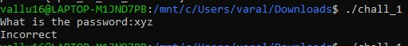 <br>
Open the file in GHIDRA and analyze the code.
There we can observe a check function is being called in the main function and the input password is given as the argument.  <br>
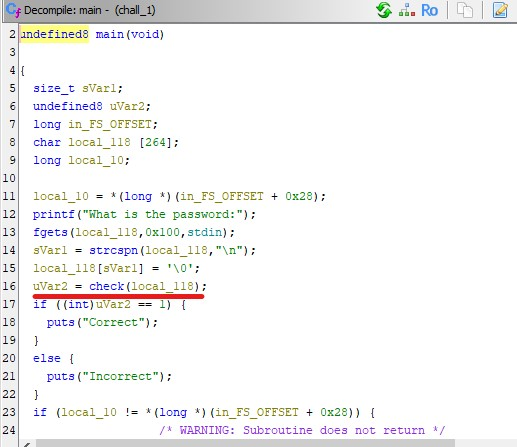 <br>
Opening the check() function, we can see the conditions which are checked for CORRECT password. 
Given are the conditions: <br>
-> Length of password = 10 <br>
-> Character at 0<sup>th</sup> index = '1' <br>
-> Character at 4<sup>th</sup> index = '9' <br>
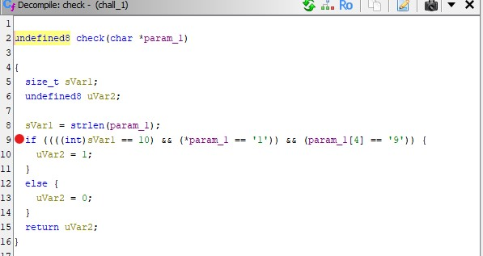 <br>

Run the file again and type any password satisfying the above conditions. <br>
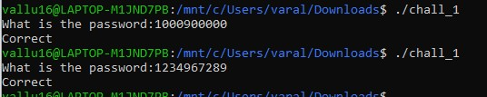 <br>

    PASSWORD: 1XXX9XXXXX

## Challenge 2
Run the file in the terminal. It asks for password. Try any random password. It shows incorrect. <br>
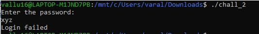 <br>
Open the file in GHIDRA and analyze the code. In the main() function u can see a checkPassword() function which is being called and it returns a value which is stored in a variable. <br>
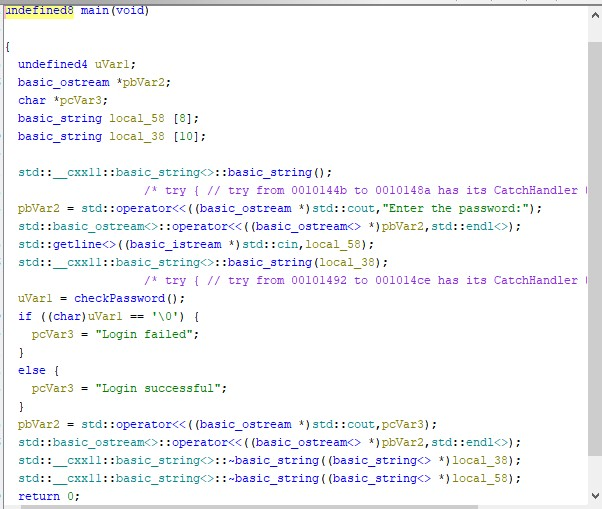 <br>
Analyzing the checkPassword() function we can see that in the string local_48 some data is being stored from DAT_00102005 <br>
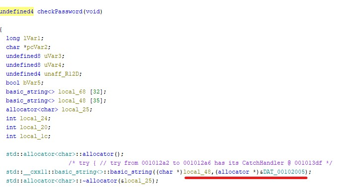 <br>
See what is stored in DAT_00102005 (a string 'dec'). <br>
 <br>
Using this string go to the next step in the checkPassword() function. We can observe that each time the character of local_48 variable gets added to the local_68 variable. As soon as we encounter the last character of the variable 'kcar' gets added to local_68 followed by the last character.
This string is reversed and is checked if it is equal to the user input. <br>
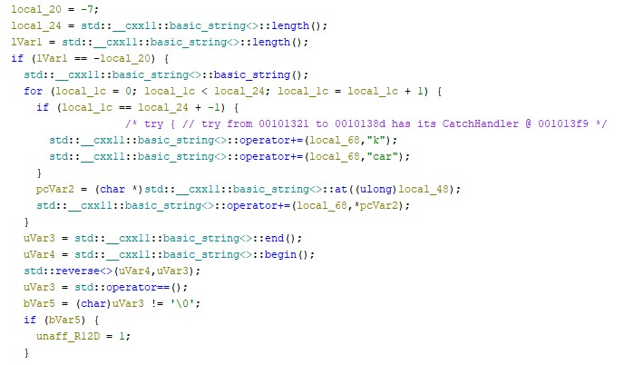 <br>
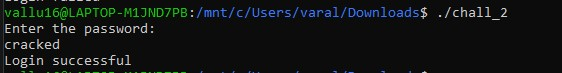 <br>

    PASSWORD: cracked

## Challenge 4
Run the file in the terminal. It asks for password. Try any random password. It shows incorrect. <br>
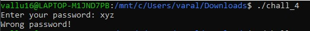 <br>
Opening the file in GHIDRA and analyzing the entry() function. We can see that the verify function is called 4 times. Also the condition being checked for the correct password is:  <br>
R13==1070 && R15+11==R15 <br>
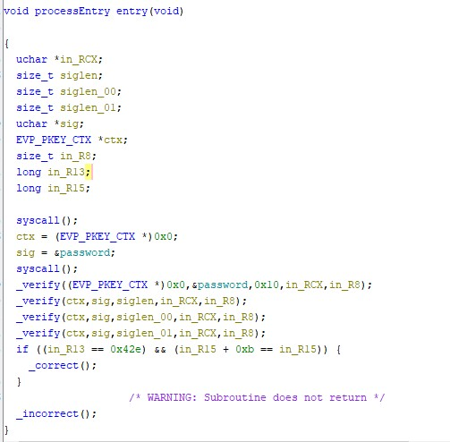 <br>
But in actual case the condition for checking the password is different as seen here: <br>
R13==1070 && R12+11==R15 <br>
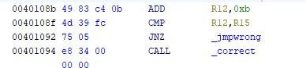 <br>
Now to get the correct password we need to find the relation between the user_input and the values of R13,R12 and R15. <br>
Next we shall jump to verify() function. Nothing much can be found here. There is a do-while loop iterating 4 times. There is a iterator and a variable getting increased by 1 in each iteration. <br>
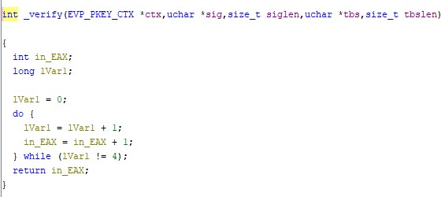 <br>
Now let's see the binary value of this verify() function. <br>
According to the imaged provided below we can get some points about the function: <br>
-> There is a pointer tbs which on call of _verify() function is getting xor'd with itself. <br>
-> R15 is being set to 0 on every call of _verify() function as it is getting xor'd with itself. <br>
-> In the _verifyLoop() function the iterator value is being increased by 1. <br>
-> The pointer tbs is getting pointed to RAX. <br>
-> The pointer gets incremented by 1. <br>
-> Every time the ASCII value at tbs position is added to R15. <br>
-> The while condition is being checked. <br>
-> As the loop ends, the value of R15 is added to R13. <br>
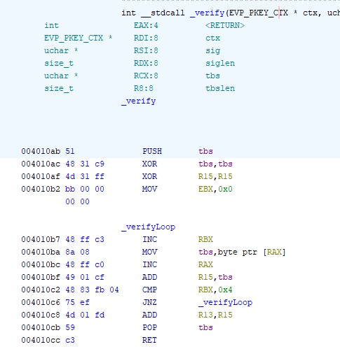 <br>
Now getting back to the entry() function and checking its binary format: <br>
-> Now, first of all the value at position password is copies to RAX and verify() function is called. <br>
-> After the verify() function the value of R15 is copied to R12. <br>
-> The data at DAT_00402040 is copied to RAX. <br>
-> Again the verify() function is called and then the value of R12 and R15 is compared. This means that the first four and the next four bytes are equal. <br>
-> Similarly the value at DAT_0040203c is copied to RAX and after verify() function the value of R15 is copied to R14. <br>
-> Again, value at DAT_00402044 IS MOVED TO RAX and after verify() function the values of R14 is compared to R15. This means the values at [8,12) and [12,16) are equal. <br>
-> This suggests that the password will be of 16 characters long <br>
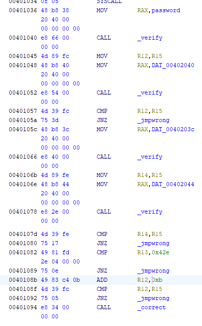 <br>
LOGIC:

    After FIRST _verify()
        R15 = x
        R12 = x
        R13 = x

    After SECOND _verify()
        R15 = x
        R13 = 2x
    
    After THIRD _verify()
        R15 = y
        R13 = 2x + y
        R14 = y

    After FOURTH _verify()
        R15 = y
        R13 = 2x + 2y

    IF CONDITION
        R13 == 1070
        R12 + 11 == R15


    Calculating the values:
        2x + 2y = 1070
        x + 11 = y

        x = 262
        y = 273

The logic doesn't end here. The data is stored like 1->2->3->4 for each of the four bytes in order as entered by the user, but it is called as 1->3->2->4. This means while entering the password bytes in range [0,3] and [8,11] should be equal to sum 262 whereas bytes in raneg [4,7] and [12,15] should be equal to sum 273 individually. <br>
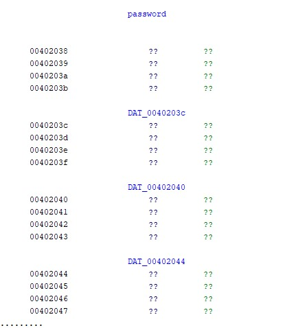

**KEYGEN:**
```python
def key (num):
    for a in range (65,91):
        for b in range (65,91):
            for c in range (65,91):
                for d in range (65,91):
                    if a+b+c+d == num:
                        partial_key = chr(a)+chr(b)+chr(c)+chr(d)
                        return partial_key


x = key(262)
y = key(273)
ans = 2*(x + y)
print(ans)
```
There can be multiple answers to this question but we are taking into consideration the first choice and returning its value.
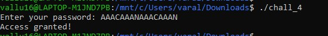

## Challenge 5
Executes the file and tried some random password.
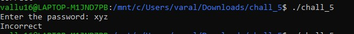
Opened the file and looked for the main function. We can observe that obfuscatePassword() function is being called first. Thereafter, the password is being entered and each character of the user_input is being xor'd with 'm'(0x6d). Later on the obfuscates password and the user_input password after being xor'd are compared. If the password is correct, calculator gets opened with answer zero because of calc() function.
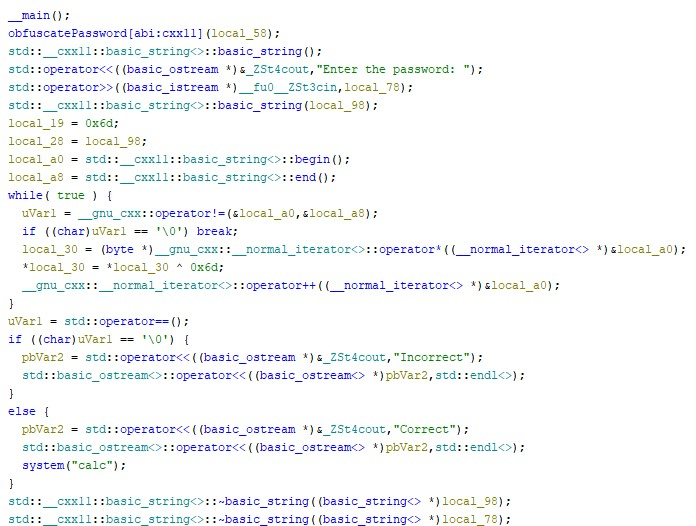
In the obfuscatePassword() function the string "0xJam3z" is being xor'd with 'm' and later on returned.
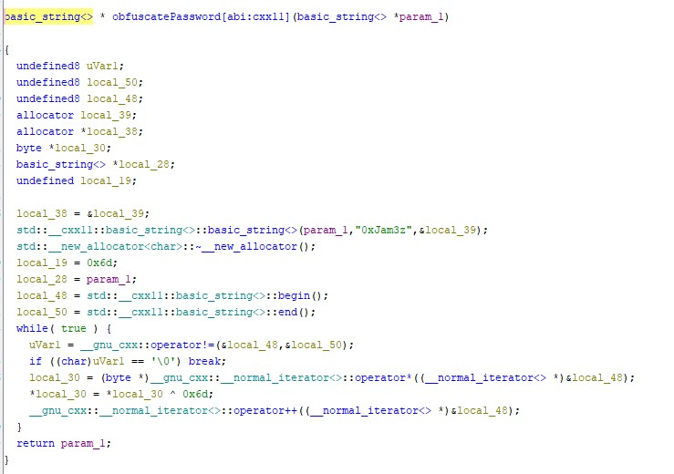
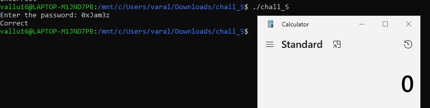

# 4.2 - Memory Corruption
## Stack 0
```C
#include <stdlib.h>
#include <unistd.h>
#include <stdio.h>

int main(int argc, char **argv)
{
  volatile int modified;
  char buffer[64];

  modified = 0;
  gets(buffer);

  if(modified != 0) {
      printf("you have changed the 'modified' variable\n");
  } else {
      printf("Try again?\n");
  }
}
```
While executing, we can see the warning on use of gets function. <br>
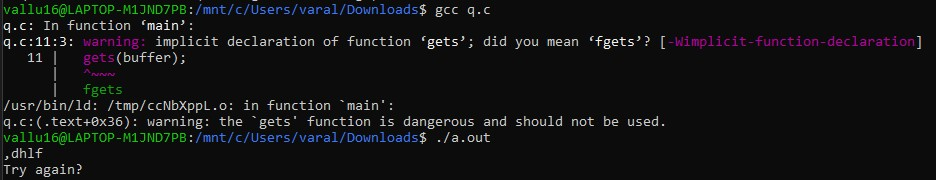 <br>
Now we'll open the protostar in virtual machine and login with 'user' username and password 'user'. Move to the directory where the code is stored. (cd /opt/protostar/bin) <br>
Now using gdb to get the disassembled version of the code. <br>
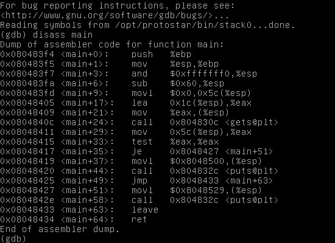 <br>
We can see that **gets** function is being used which allows writing beyond the declared size, being able to overwrite the adjacent variables in the stack. <br>
The given buffer is of size 64. Let's try to overflow the stack so as to overwrite the value of variable 'modified'. <br>
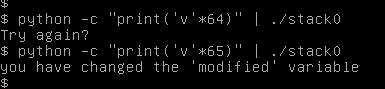 <br>
Yeah, we changed the value of variable 'modified'. <br>

## Stack 1
```C
#include <stdlib.h>
#include <unistd.h>
#include <stdio.h>
#include <string.h>

int main(int argc, char **argv)
{
  volatile int modified;
  char buffer[64];

  if(argc == 1) {
      errx(1, "please specify an argument\n");
  }

  modified = 0;
  strcpy(buffer, argv[1]);

  if(modified == 0x61626364) {
      printf("you have correctly got the variable to the right value\n");
  } else {
      printf("Try again, you got 0x%08x\n", modified);
  }
}
```
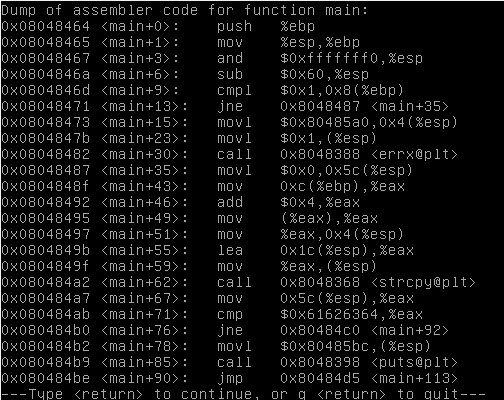 <br>
According to the code we can see that this time **gets** function is not used instead the string is is getting copied from argv[1]. <br>
Trying some random value <br>
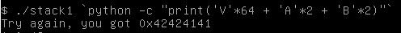 <br>
We can observe that as we input characters more than 64 the stack overflows and the value of modifies function becomes the hex digit of the character corresponding to the next first four places after 64 characters in the reversed order. <br>
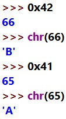 <br>
Therefore we should input the asked result in the reverse order with 64 ranfdom characters in the beginning. <br>
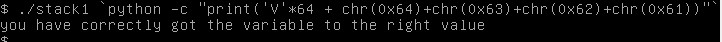 <br>
Yeah, we changed the value of variable 'modified'. <br>

## Stack 2
```C
#include <stdlib.h>
#include <unistd.h>
#include <stdio.h>
#include <string.h>

int main(int argc, char **argv)
{
  volatile int modified;
  char buffer[64];
  char *variable;

  variable = getenv("GREENIE");

  if(variable == NULL) {
      errx(1, "please set the GREENIE environment variable\n");
  }

  modified = 0;

  strcpy(buffer, variable);

  if(modified == 0x0d0a0d0a) {
      printf("you have correctly modified the variable\n");
  } else {
      printf("Try again, you got 0x%08x\n", modified);
  }

}
```
Tried to export the environment variable GREENIE with the required value after trial and errors but it isn't working. Tried different sort of methods. <br>
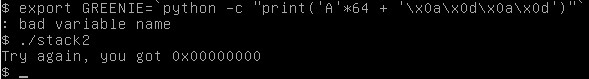 <br>
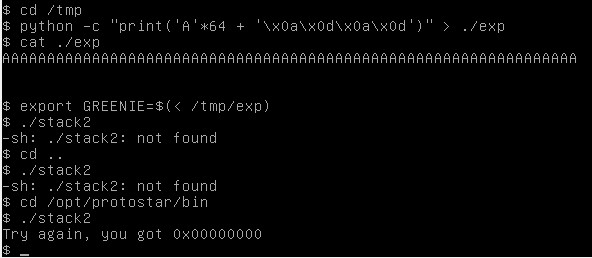 <br>

## Stack 3
```C
#include <stdlib.h>
#include <unistd.h>
#include <stdio.h>
#include <string.h>

void win()
{
  printf("code flow successfully changed\n");
}

int main(int argc, char **argv)
{
  volatile int (*fp)();
  char buffer[64];

  fp = 0;

  gets(buffer);

  if(fp) {
      printf("calling function pointer, jumping to 0x%08x\n", fp);
      fp();
  }
}
```
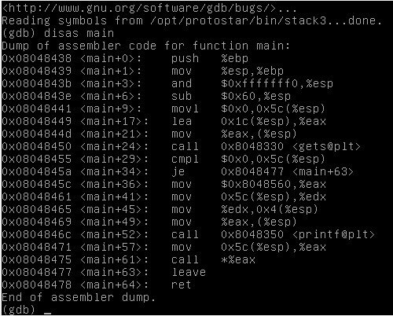 <br>
As given in hint use **objdump** command to find the address of win() function. Try some random values. We can observe that we need to overflow the buffer and add the address of the win() function in order to call it. <br>
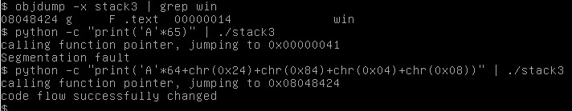 <br>

## Stack 4
```C
#include <stdlib.h>
#include <unistd.h>
#include <stdio.h>
#include <string.h>

void win()
{
  printf("code flow successfully changed\n");
}

int main(int argc, char **argv)
{
  char buffer[64];

  gets(buffer);
}
```
There is no point of buffer overflow as there isn't any other variable to overwrite in order to call the win() function.
But we can go at that point where the main function is getting returned. First we find the address of the win() function and then by trial and errors we get to know where the main() function is getting returned and giving 'Segmentation Fault'. Accordingly we overflow the buffer and type the address of win() function. <br>
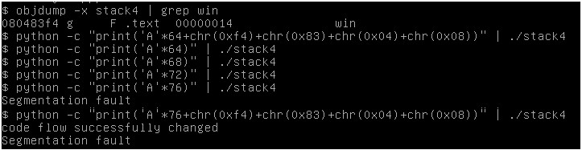 <br>

## Stack 5
```C
#include <stdlib.h>
#include <unistd.h>
#include <stdio.h>
#include <string.h>

int main(int argc, char **argv)
{
  char buffer[64];

  gets(buffer);
}
```